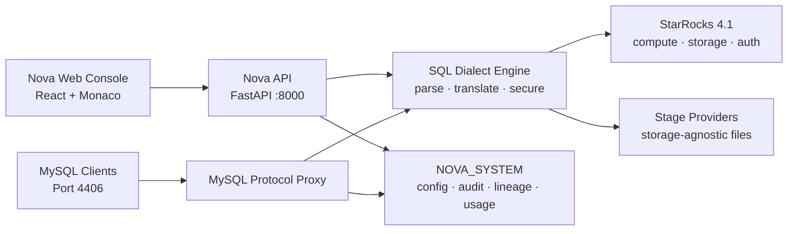

<div align="center">
  

  # Nova

  ### The data warehouse and AI platform powered by StarRocks

  Run analytics, manage data, work with files, and build AI-powered workflows
  through one fast, secure, and storage-agnostic platform.

  [](https://www.starrocks.io/)
  [](backend/)
  [](frontend/)
  [](backend/pyproject.toml)

  [Quick start](#quick-start) · [Architecture](#architecture) · [Documentation](#documentation)
</div>

---

## One platform. From raw files to intelligent products.

Nova brings a Snowflake-grade management experience to StarRocks without hiding
the engine that makes it fast.

Instead of stitching together separate tools for SQL, object storage, access
control, observability, ML, and AI, Nova exposes them through a consistent web
console, API, SQL dialect, and MySQL-compatible interface.

```sql
-- Query a staged file without exposing its storage provider or credentials.
SELECT *
FROM @production.sales.orders.parquet
WHERE order_date >= CURRENT_DATE - INTERVAL 7 DAY;
```

Nova resolves the stage, detects the file format, injects credentials securely,
translates the query into StarRocks SQL, and records the action in the audit log.

## Why Nova?

| Capability | What Nova provides |
|---|---|
| **Fast analytics** | StarRocks-powered real-time OLAP and interactive SQL |
| **Unified workspace** | SQL worksheet, catalog exploration, data management, and monitoring |
| **Stage-native files** | Storage-agnostic file access through the sacred `@stage` syntax |
| **Native security** | StarRocks users and grants remain the source of truth |
| **Credential isolation** | Storage and user credentials never appear in UI state, API responses, logs, or system tables |
| **MySQL compatibility** | Connect existing MySQL clients through Nova's protocol proxy |
| **Built-in intelligence** | ML workflows and SQL-native AI functions such as `AI_COMPLETE` and `AI_SENTIMENT` |
| **Operational visibility** | Audit history, query analytics, lineage, quality statistics, and cluster insights |

## The Nova experience

### Query everything

Use a Monaco-powered SQL workspace for tables, views, staged files, external
catalogs, ML models, and AI functions.

```sql
SELECT
    customer_id,
    AI_SENTIMENT(review_text) AS sentiment
FROM analytics.customer_reviews;
```

### Treat files like data

Stages provide one stable abstraction over S3-compatible storage, Azure, GCS,
and future providers. Users work with stage names—not endpoints, buckets, or
credentials.

```sql
SELECT * FROM @raw.events.2026.06.18.json;
```

### Bring your existing tools

Nova's MySQL protocol proxy lets compatible SQL clients connect on port `4406`
while preserving Nova's dialect translation, access checks, and audit trail.

### Build intelligence into SQL

Nova extends the warehouse with approachable ML and AI primitives:

```sql
CREATE ML_MODEL revenue_forecast TYPE = FORECAST
    INPUT = (SELECT event_time, revenue FROM analytics.daily_revenue)
    TIMESTAMP = 'event_time'
    TARGET = 'revenue';
```

## Architecture



### Core design principles

1. **StarRocks is the source of truth.** Nova does not maintain a separate user database.
2. **Credentials are invisible.** Secrets stay in configuration or encrypted session memory.
3. **The UI is storage-agnostic.** Provider-specific infrastructure never leaks into the user experience.
4. **`@stage` is a first-class SQL primitive.** File access always flows through the dialect engine.
5. **Persistent state belongs in `NOVA_SYSTEM`.** Nova does not introduce SQLite or PostgreSQL.
6. **Every meaningful action is auditable.**
7. **`ACCOUNTADMIN` is immutable.** The system's highest-privilege role cannot be dropped or revoked.

## Quick start

### Prerequisites

- Docker with Docker Compose
- Python 3.11+ and [uv](https://docs.astral.sh/uv/)
- Node.js with [pnpm](https://pnpm.io/)
- A MySQL client for direct engine access

### 1. Start the engine

```bash
cd docker
cp .env.example .env
docker compose -f docker-compose-engine.yml up -d
```

Verify the infrastructure:

```bash
docker compose -f docker-compose-engine.yml ps
curl http://localhost:8030/api/health
```

### 2. Start the backend

```bash
cd backend
cp .env.example .env
uv sync
uv run uvicorn app.main:app --reload --port 8000
```

Backend endpoints:

- API: [http://localhost:8000](http://localhost:8000)
- OpenAPI: [http://localhost:8000/docs](http://localhost:8000/docs)
- Health: [http://localhost:8000/health](http://localhost:8000/health)

### 3. Start the frontend

```bash
cd frontend
pnpm install
pnpm dev
```

Open [http://localhost:5173](http://localhost:5173).

### 4. Connect directly to StarRocks

```bash
mysql -h 127.0.0.1 -P 9030 -u nova_admin -p
```

The development password is `nova`. Change it after the first login.

> Never expose the passwordless StarRocks `root` user outside the internal
> Docker network.

## Local services

| Service | Address | Purpose |
|---|---|---|
| Nova Web | `localhost:5173` | React application |
| Nova API | `localhost:8000` | FastAPI backend |
| Nova MySQL Proxy | `localhost:4406` | Nova-aware MySQL protocol |
| StarRocks FE HTTP | `localhost:8030` | Engine API and health |
| StarRocks MySQL | `localhost:9030` | Direct development connection |
| StarRocks BE HTTP | `localhost:8040` | Backend node API |
| Object Storage API | `localhost:9000` | Local stage storage |
| Object Storage Console | `localhost:9001` | Local storage administration |
| Redis | `localhost:6379` | Sessions and query cache |

## Technology

| Layer | Stack |
|---|---|
| Query engine | StarRocks 4.1 |
| Backend | Python 3.11, FastAPI, Pydantic, async MySQL |
| Frontend | React 19, TypeScript, Vite, Tailwind CSS, shadcn/ui |
| SQL workspace | Monaco Editor |
| State and data | Zustand, TanStack Query, TanStack Router |
| Infrastructure | Docker Compose, Redis, S3-compatible local storage |
| Testing | Pytest, Vitest, Playwright |

## Project structure

```text
nova/
├── backend/              # FastAPI application and domain modules
│   ├── app/
│   │   ├── core/         # Configuration, security, database, Redis
│   │   ├── modules/      # Auth, query, objects, stages, users, AI/ML
│   │   └── common/       # Shared NOVA_SYSTEM infrastructure
│   └── tests/
├── frontend/             # React application
│   ├── public/images/    # Nova brand assets
│   └── src/              # Routes, features, components, state
├── docker/               # StarRocks and local infrastructure
├── docs/                 # Product and architecture specifications
├── AGENTS.md             # Engineering rules for AI agents
└── README.md
```

## Documentation

The [`docs/`](docs/) directory contains the detailed product specification:

- **27 feature modules** covering SQL, stages, governance, ML, dashboards,
  cluster operations, backup, indexes, and data sharing.
- **7 architecture documents** for the SQL dialect, storage providers,
  backend, frontend, system database, and MySQL proxy.
- **Gap analysis** tracking parity targets and remaining platform work.

Start with:

- [Platform overview](docs/01-overview.md)
- [SQL worksheet](docs/02-sql-worksheet.md)
- [Stage manager](docs/04-stage-manager.md)
- [Machine learning](docs/19-machine-learning.md)
- [SQL dialect architecture](docs/arch-01-sql-dialect-engine.md)
- [Backend architecture](docs/arch-03-backend-architecture.md)

## Development checks

Backend:

```bash
cd backend
uv run pytest
uv run ruff check .
```

Frontend:

```bash
cd frontend
pnpm lint
pnpm test
pnpm build
```

## Status

Nova is under active development. The architecture and product specifications
describe the target platform; individual modules may be implemented
incrementally.

## License

Internal project — not yet licensed for distribution.

---

<div align="center">
  

  **Nova** — turn fast data into intelligent action.
</div>
