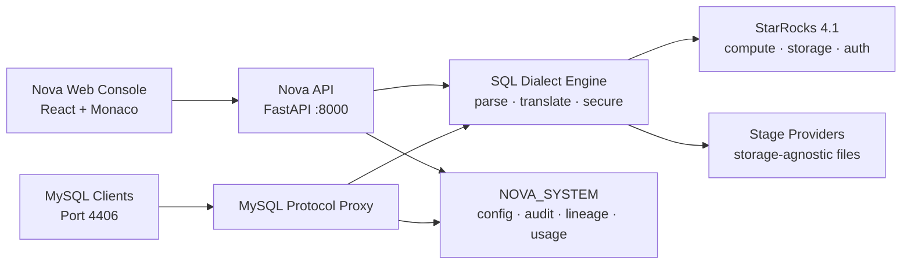

<div align="center">
  

  # Nova

  ### The data warehouse and AI platform powered by StarRocks

  Run analytics, manage data, work with files, and build AI-powered workflows
  through one fast, secure, and storage-agnostic platform.

  [](https://www.starrocks.io/)
  [](backend/)
  [](frontend/)
  [](backend/pyproject.toml)

  [Quick start](#quick-start) · [Architecture](#architecture) · [Documentation](#documentation)
</div>

---

## One platform. From raw files to intelligent products.

Nova brings a Snowflake-grade management experience to StarRocks without hiding
the engine that makes it fast.

Instead of stitching together separate tools for SQL, object storage, access
control, observability, ML, and AI, Nova exposes them through a consistent web
console, API, SQL dialect, and MySQL-compatible interface.

```sql
-- Query a staged file without exposing its storage provider or credentials.
SELECT *
FROM @production.sales.orders.parquet
WHERE order_date >= CURRENT_DATE - INTERVAL 7 DAY;
```

Nova resolves the stage, detects the file format, injects credentials securely,
translates the query into StarRocks SQL, and records the action in the audit log.

## Why Nova?

| Capability | What Nova provides |
|---|---|
| **Fast analytics** | StarRocks-powered real-time OLAP and interactive SQL |
| **Unified workspace** | SQL worksheet, catalog exploration, data management, and monitoring |
| **Stage-native files** | Storage-agnostic file access through the sacred `@stage` syntax |
| **Native security** | StarRocks users and grants remain the source of truth |
| **Credential isolation** | Storage and user credentials never appear in UI state, API responses, logs, or system tables |
| **MySQL compatibility** | Connect existing MySQL clients through Nova's protocol proxy |
| **Built-in intelligence** | ML workflows and SQL-native AI functions such as `AI_COMPLETE` and `AI_SENTIMENT` |
| **Operational visibility** | Audit history, query analytics, lineage, quality statistics, and cluster insights |

## The Nova experience

### Query everything

Use a Monaco-powered SQL workspace for tables, views, staged files, external
catalogs, ML models, and AI functions.

```sql
SELECT
    customer_id,
    AI_SENTIMENT(review_text) AS sentiment
FROM analytics.customer_reviews;
```

### Treat files like data

Stages provide one stable abstraction over S3-compatible storage, Azure, GCS,
and future providers. Users work with stage names—not endpoints, buckets, or
credentials.

```sql
SELECT * FROM @raw.events.2026.06.18.json;
```

### Bring your existing tools

Nova's MySQL protocol proxy lets compatible SQL clients connect on port `4406`
while preserving Nova's dialect translation, access checks, and audit trail.

### Build intelligence into SQL

Nova extends the warehouse with approachable ML and AI primitives:

```sql
CREATE ML_MODEL order_amount_regression
TYPE = REGRESSION
TARGET = total_amount
ALGORITHM = linear
TEST_SIZE = 0
AS SELECT
  CAST(order_id AS DOUBLE) AS order_id,
  CAST(customer_id AS DOUBLE) AS customer_id,
  CAST(total_amount AS DOUBLE) AS total_amount
FROM orders;
```

## Nova custom SQL dialect

Nova supports a small SQL dialect on top of StarRocks. Some commands are
native StarRocks SQL, while others are intercepted by Nova before they reach
StarRocks.

Run custom Nova SQL from the SQL Workspace or through the Nova Query API:

```http
POST /api/v1/query/execute
```

Do not send Nova-only syntax directly to StarRocks on port `9030`. Direct
StarRocks connections do not understand commands such as `CREATE ML_MODEL` or
`@stage` references and will return parser errors such as:

```text
No viable statement for input 'CREATE ML_MODEL'
```

### What is custom?

| Feature | Where it works | What Nova does |
|---|---|---|
| `CREATE ML_MODEL ... AS SELECT ...` | SQL Workspace, Query API | Intercepts the DDL, runs Python ML training, stores metadata and model versions in `NOVA_SYSTEM` |
| `@stage.path.file` | SQL Workspace, Query API | Resolves the stage, detects file format, injects credentials, rewrites to StarRocks `FILES(...)` |
| `AI_COMPLETE`, `AI_SENTIMENT`, `AI_CLASSIFY`, etc. | SQL Workspace after AI functions are registered | Nova manages StarRocks global UDFs and provider aliases |
| `ML_PREDICT` / prediction APIs | ML API, optionally SQL UDF when configured | Uses registered model aliases and stored model versions |

### 1. Train ML from the SQL Workspace

Nova v1 supports classical `REGRESSION` and `CLASSIFICATION` models from
worksheet SQL. The training query must return the target column and numeric
feature columns. The training data is read using the logged-in StarRocks user,
so normal StarRocks RBAC still applies.

Use database context `NOVA_EXAMPLE` for the seeded demo data.

Regression example:

```sql
CREATE ML_MODEL demo_order_amount_regression
TYPE = REGRESSION
TARGET = total_amount
ALGORITHM = linear
TEST_SIZE = 0
AS SELECT
  CAST(order_id AS DOUBLE) AS order_id,
  CAST(customer_id AS DOUBLE) AS customer_id,
  CAST(total_amount AS DOUBLE) AS total_amount
FROM orders;
```

Classification example:

```sql
CREATE ML_MODEL demo_order_status_classifier
TYPE = CLASSIFICATION
TARGET = status
ALGORITHM = decision_tree
TEST_SIZE = 0
AS SELECT
  CAST(order_id AS DOUBLE) AS order_id,
  CAST(customer_id AS DOUBLE) AS customer_id,
  CAST(total_amount AS DOUBLE) AS total_amount,
  status
FROM orders;
```

Supported clauses:

| Clause | Required | Example | Notes |
|---|---:|---|---|
| `TYPE` | Yes | `TYPE = REGRESSION` | `REGRESSION` or `CLASSIFICATION` |
| `TARGET` | Yes | `TARGET = total_amount` | Must be present in the `SELECT` output |
| `ALGORITHM` | No | `ALGORITHM = random_forest` | `auto`, `linear`, `logistic`, `decision_tree`, `random_forest`, `gradient_boost`, `knn`, `svm` |
| `TEST_SIZE` | No | `TEST_SIZE = 0.2` | Use `0` for tiny demo datasets |
| `FEATURES` | No | `FEATURES = (order_id, customer_id)` | Defaults to all columns except target |
| `HYPERPARAMETERS` | No | `HYPERPARAMETERS = JSON '{"n_estimators": 50}'` | Must be a JSON object |
| `AS SELECT` | Yes | `AS SELECT ... FROM orders` | Supplies the training data |

The worksheet returns one result row with:

```text
model_id, model_name, model_type, algorithm, version, status,
training_rows, feature_columns, metrics
```

The model is stored in:

```sql
SELECT model_id, model_name, model_type, target_column, feature_columns, created_at
FROM NOVA_SYSTEM.ML_MODELS
ORDER BY created_at DESC;
```

Model versions and metrics are stored in:

```sql
SELECT m.model_name, v.version, v.status, v.training_rows, v.metrics, v.created_at
FROM NOVA_SYSTEM.ML_MODELS m
JOIN NOVA_SYSTEM.ML_MODEL_VERSIONS v ON m.model_id = v.model_id
ORDER BY v.created_at DESC;
```

### 2. Use trained ML models

The reliable v1 path for prediction is the ML API. First create an alias for a
model version:

```bash
export NOVA_TOKEN="$(
  curl -s http://localhost:8000/api/v1/auth/login \
    -H "Content-Type: application/json" \
    -d '{"username":"root","password":""}' \
  | python -c 'import json,sys; print(json.load(sys.stdin)["access_token"])'
)"
```

```bash
curl -X POST http://localhost:8000/api/v1/ml/aliases \
  -H "Authorization: Bearer $NOVA_TOKEN" \
  -H "Content-Type: application/json" \
  -d '{
    "alias_name": "order_amount_predictor",
    "model_id": "<model_id from worksheet result>",
    "version": 1
  }'
```

Single prediction:

```bash
curl -X POST http://localhost:8000/api/v1/ml/predict \
  -H "Authorization: Bearer $NOVA_TOKEN" \
  -H "Content-Type: application/json" \
  -d '{
    "model_alias": "order_amount_predictor",
    "features": {
      "order_id": 1016,
      "customer_id": 5
    }
  }'
```

Batch prediction from SQL:

```bash
curl -X POST http://localhost:8000/api/v1/ml/predict/batch \
  -H "Authorization: Bearer $NOVA_TOKEN" \
  -H "Content-Type: application/json" \
  -d '{
    "model_alias": "order_amount_predictor",
    "prediction_sql": "SELECT CAST(order_id AS DOUBLE) AS order_id, CAST(customer_id AS DOUBLE) AS customer_id FROM NOVA_EXAMPLE.orders LIMIT 5",
    "database_name": "NOVA_EXAMPLE"
  }'
```

`ML_PREDICT(...)` exists as a Nova-managed UDF surface, but deployments may
return a helper message until the runtime UDF is configured. Use the API path
above for guaranteed v1 predictions.

### 3. Query staged files with `@stage`

`@stage` is a Nova abstraction over storage. Users see stage names and paths,
not buckets, endpoints, or credentials.

```sql
SELECT *
FROM @production.sales.orders.parquet
WHERE order_date >= CURRENT_DATE - INTERVAL 7 DAY;
```

Nova rewrites the query to a StarRocks `FILES(...)` call with the correct path,
format, and credentials. The original credentials never appear in UI state,
API responses, logs, or `NOVA_SYSTEM` tables.

Common patterns:

```sql
-- Read a CSV file from a stage.
SELECT *
FROM @demo_stage.imports.orders.csv;

-- Create a StarRocks table from staged data.
CREATE TABLE imported_orders AS
SELECT *
FROM @demo_stage.imports.orders.csv;

-- Join staged data with a managed table.
SELECT o.order_id, o.total_amount, c.first_name
FROM @demo_stage.imports.orders.csv o
JOIN customers c ON o.customer_id = c.customer_id;
```

### 4. Use AI functions in SQL

Nova manages AI provider configuration and StarRocks global UDFs for common LLM
tasks. Configure providers and function aliases in the AI Providers UI, then
register or re-register the UDFs from the Functions tab.

Available function surfaces include:

```sql
SELECT AI_COMPLETE('Write a haiku about databases') AS result;

SELECT AI_SENTIMENT('I love this product') AS sentiment;

SELECT AI_CLASSIFY(
  'The customer needs help with an invoice',
  'billing, technical, account, sales'
) AS category;

SELECT AI_SUMMARIZE(
  'StarRocks is a high-performance analytical database for real-time workloads...'
) AS summary;

SELECT AI_EXTRACT(
  'Jane Doe lives in Jakarta and works as a data engineer.',
  'name, city, occupation'
) AS extracted_json;

SELECT AI_TRANSLATE('Good morning', 'Indonesian') AS translated_text;

SELECT AI_FILTER(
  'The order was delayed and the customer is unhappy.',
  'is this a support escalation?'
) AS should_escalate;
```

If an AI function returns a configuration error, create or update its alias in
the AI Providers page and re-register UDFs. The provider API key is resolved by
Nova and must not be embedded in worksheet SQL.

## Screenshots

### Database Explorer


### Workspaces


## Architecture


```mermaid
flowchart LR
    UI["Nova Web Console<br/>React + Monaco"]
    CLIENT["MySQL Clients<br/>Port 4406"]
    API["Nova API<br/>FastAPI :8000"]
    PROXY["MySQL Protocol Proxy"]
    PIPELINE["SQL Dialect Engine<br/>parse · translate · secure"]
    SR["StarRocks 4.1<br/>compute · storage · auth"]
    STAGE["Stage Providers<br/>storage-agnostic files"]
    SYSTEM["NOVA_SYSTEM<br/>config · audit · lineage · usage"]

    UI --> API
    CLIENT --> PROXY
    API --> PIPELINE
    PROXY --> PIPELINE
    PIPELINE --> SR
    PIPELINE --> STAGE
    API --> SYSTEM
    PROXY --> SYSTEM
```

### Core design principles

1. **StarRocks is the source of truth.** Nova does not maintain a separate user database.
2. **Credentials are invisible.** Secrets stay in configuration or encrypted session memory.
3. **The UI is storage-agnostic.** Provider-specific infrastructure never leaks into the user experience.
4. **`@stage` is a first-class SQL primitive.** File access always flows through the dialect engine.
5. **Persistent state belongs in `NOVA_SYSTEM`.** Nova does not introduce SQLite or PostgreSQL.
6. **Every meaningful action is auditable.**
7. **`ACCOUNTADMIN` is immutable.** The system's highest-privilege role cannot be dropped or revoked.

## Quick start

### Prerequisites

- Docker with Docker Compose
- Python 3.11+ and [uv](https://docs.astral.sh/uv/)
- Node.js with [pnpm](https://pnpm.io/)
- A MySQL client for direct engine access

### 1. Start the engine

```bash
cd docker
cp .env.example .env
docker compose -f docker-compose-engine.yml up -d
```

Verify the infrastructure:

```bash
docker compose -f docker-compose-engine.yml ps
curl http://localhost:8030/api/health
```

### 2. Start the backend

```bash
cd backend
cp .env.example .env
uv sync
uv run uvicorn app.main:app --reload --port 8000
```

Backend endpoints:

- API: [http://localhost:8000](http://localhost:8000)
- OpenAPI: [http://localhost:8000/docs](http://localhost:8000/docs)
- Health: [http://localhost:8000/health](http://localhost:8000/health)

### 3. Start the frontend

```bash
cd frontend
pnpm install
pnpm dev
```

Open [http://localhost:5173](http://localhost:5173).

### 4. Connect directly to StarRocks

```bash
mysql -h 127.0.0.1 -P 9030 -u nova_admin -p
```

The development password is `nova`. Change it after the first login.

> Never expose the passwordless StarRocks `root` user outside the internal
> Docker network.

## Local services

| Service | Address | Purpose |
|---|---|---|
| Nova Web | `localhost:5173` | React application |
| Nova API | `localhost:8000` | FastAPI backend |
| Nova MySQL Proxy | `localhost:4406` | Nova-aware MySQL protocol |
| StarRocks FE HTTP | `localhost:8030` | Engine API and health |
| StarRocks MySQL | `localhost:9030` | Direct development connection |
| StarRocks BE HTTP | `localhost:8040` | Backend node API |
| Object Storage API | `localhost:9000` | Local stage storage |
| Object Storage Console | `localhost:9001` | Local storage administration |
| Redis | `localhost:6379` | Sessions and query cache |

## Technology

| Layer | Stack |
|---|---|
| Query engine | StarRocks 4.1 |
| Backend | Python 3.11, FastAPI, Pydantic, async MySQL |
| Frontend | React 19, TypeScript, Vite, Tailwind CSS, shadcn/ui |
| SQL workspace | Monaco Editor |
| State and data | Zustand, TanStack Query, TanStack Router |
| Infrastructure | Docker Compose, Redis, S3-compatible local storage |
| Testing | Pytest, Vitest, Playwright |

## Project structure

```text
nova/
├── backend/              # FastAPI application and domain modules
│   ├── app/
│   │   ├── core/         # Configuration, security, database, Redis
│   │   ├── modules/      # Auth, query, objects, stages, users, AI/ML
│   │   └── common/       # Shared NOVA_SYSTEM infrastructure
│   └── tests/
├── frontend/             # React application
│   ├── public/images/    # Nova brand assets
│   └── src/              # Routes, features, components, state
├── docker/               # StarRocks and local infrastructure
├── docs/                 # Product and architecture specifications
├── AGENTS.md             # Engineering rules for AI agents
└── README.md
```

## Documentation

The [`docs/`](docs/) directory contains the detailed product specification:

- **27 feature modules** covering SQL, stages, governance, ML, dashboards,
  cluster operations, backup, indexes, and data sharing.
- **7 architecture documents** for the SQL dialect, storage providers,
  backend, frontend, system database, and MySQL proxy.
- **Gap analysis** tracking parity targets and remaining platform work.

Start with:

- [Platform overview](docs/01-overview.md)
- [SQL worksheet](docs/02-sql-worksheet.md)
- [Stage manager](docs/04-stage-manager.md)
- [Machine learning](docs/19-machine-learning.md)
- [SQL dialect architecture](docs/arch-01-sql-dialect-engine.md)
- [Backend architecture](docs/arch-03-backend-architecture.md)

## Development checks

Backend:

```bash
cd backend
uv run pytest
uv run ruff check .
```

Frontend:

```bash
cd frontend
pnpm lint
pnpm test
pnpm build
```

## Status

Nova is under active development. The architecture and product specifications
describe the target platform; individual modules may be implemented
incrementally.

> **Documentation vs implementation — known discrepancy.** `AGENTS.md`
> ("Project Structure") describes the backend layout as `app/core/`, `app/db/`,
> `app/models/`, `app/schemas/`, `app/services/`, `app/sql_dialect/`,
> `app/storage/`, `app/proxy/`, `app/api/v1/endpoints/`. The repository does not
> use that layout: only `app/core/` and `app/common/` exist as shared packages,
> and all domain code lives in `app/modules/<domain>/` (routers, services,
> schemas colocated per module, registered in `app/main.py`). `app/proxy/` does
> not exist at all — see Phase 8. `AGENTS.md` and this README have not been
> reconciled; treat `app/modules/` as the real layout until `AGENTS.md` is
> updated.

Roadmap checkboxes below are marked only where the code in this repository
proves the item; each line cites its evidence. Lines marked `[ ]` that have
partial implementation say so explicitly.

## Roadmap

### Phase 1 — Foundation & Auth ✅
- [x] Docker infrastructure (StarRocks FE/BE, MinIO, Redis) — `docker/docker-compose-engine.yml` (starrocks/fe-ubuntu:4.1.1, be-ubuntu:4.1.1, minio, redis:7-alpine)
- [x] FastAPI modular monolith with asyncmy driver — `backend/app/main.py`, `backend/app/core/database.py:6` (`import asyncmy`)
- [x] JWT + Redis session management — `backend/app/core/redis.py`, `backend/app/modules/auth/service.py`
- [x] StarRocks-native authentication (first-login setup wizard) — `backend/app/modules/auth/{router,service}.py`; the frontend implements this as a **setup form inside sign-in**, not a separate wizard route (`frontend/src/features/auth/sign-in/components/user-auth-form.tsx:29,88,147`)
- [x] ACCOUNTADMIN role guard (immutable super user) — `backend/app/common/sql_guard.py`, `backend/app/core/{deps,exceptions}.py`, `backend/app/modules/users/service.py`
- [x] NOVA_SYSTEM database initialization (CONFIG, AUDIT) — `docker/init-nova.sql:50-390`, `backend/app/common/nova_system.py`. **Note:** the SQL uses flat `NOVA_SYSTEM.CONFIG_*` / `ML_*` / `AUDIT_*` tables; `AGENTS.md` documents a nested schema layout (`CONFIG.STAGES`, `AUDIT.LOG`) that the code does not use
- [x] Frontend: Sign-in page (split-screen), auth guard, JWT cookie — `frontend/src/features/auth/sign-in/sign-in-2.tsx` (`lg:grid-cols-2`), `frontend/src/routes/_authenticated/route.tsx`

### Phase 2 — Query Engine 🔶
- [x] SQL execution via asyncmy per-user connections — `backend/app/modules/query/service.py`, `backend/app/core/database.py:63-71`
- [ ] @stage SQL dialect — translator + credential injector exist, but the parse stage is regex-on-text and eight defects are confirmed open. **Downgraded from `[x]` by NOVA-17** (audit on `237a64b`, re-confirmed at `f29c449`): `_normalize_default_schema_qualification` (`service.py:1016`, called at `:80` and `:572`) corrupts valid SQL — `@stage1.data.default.csv` → `@stage1.data.csv` and `config.default.value` → `config.value`; `@@version` and a `@stage` ref inside a comment produce false-positive stage refs; `@stage1/folder/x.csv` (slash path) and the glob `@stage1.data/*.csv` are not detected; `CREATE ML_MODEL ... TYPE = FORECAST` raises although `AGENTS.md:245` and `docs/19-machine-learning.md:184` document it; `training_sql` is executed raw at `ml_engine/service.py:665,685` with no guard, no `@stage` translation, no credential injection and no redaction
- [x] File format auto-detection (CSV, Parquet, JSON, ORC, Avro) — `backend/app/modules/query/dialect/detector.py:13-14` (magic bytes) + `parser.py:60` (extension list)
- [x] Query history with audit logging — `backend/app/modules/query/repository.py`, `backend/app/common/audit.py` (14 call sites)
- [x] Destructive SQL guard (DROP, TRUNCATE, DELETE confirmation) — `backend/app/common/sql_guard.py`, `backend/app/modules/query/service.py:94`
- [x] Frontend: Monaco editor, results table, multi-tab, Ctrl+Enter — `frontend/src/features/workspaces/index.tsx`

### Phase 3 — Object Browser ✅
- [x] Catalog → Database → Schema → Table/View/MV/Function tree — `backend/app/modules/explorer/router.py`, `frontend/src/features/database-explorer/index.tsx` (`buildCatalogTree`, 2667 lines)
- [x] SHOW / DESCRIBE / INFORMATION_SCHEMA queries — `backend/app/modules/objects/router.py`, `.../explorer/router.py`
- [x] Table column metadata with types — `backend/app/modules/objects/router.py:160`
- [x] Schema browser in sidebar (DatabaseExplorer) — `frontend/src/components/layout/data/sidebar-data.ts` ("Database Explorer")
- [x] Frontend: Object browser panel, schema pre-loading — `frontend/src/features/database-explorer/index.tsx`

### Phase 4 — Stage & Storage 🔶
- [x] Storage provider abstraction (S3/MinIO) — `backend/app/core/config.py` + `backend/app/modules/stages/service.py` (boto3/S3 client)
- [x] Stage CRUD registered in `NOVA_SYSTEM.CONFIG_STAGES` — `backend/app/modules/stages/{router,service}.py`
- [x] File operations: browse, upload, download, delete — `backend/app/modules/stages/router.py:80-140`
- [x] CTAS from stage, export to stage — only as dialect command types (`STAGE_LOAD` / `STAGE_EXPORT` in `backend/app/modules/query/dialect/parser.py:23-24`); no dedicated UI or end-to-end test yet
- [ ] Schema-bound access control (RBAC on stage files) — stage records carry `database_name` / `schema_name`, but no privilege check is enforced in `backend/app/modules/stages/service.py`
- [x] NOVA_DEMO sample database (customers, orders, order_items) — `docker/init-nova.sql:401-460`. **Note:** `products` lives in `NOVA_CATALOG.products` (`docker/init-nova.sql:494-497`), not in `NOVA_DEMO`
- [ ] Stage Manager page — no `frontend/src/features/stages/`; only the database-explorer tree can create/list stage files (`frontend/src/features/database-explorer/index.tsx`)

### Phase 5 — Administration 🔶
- [x] User management (create, alter, drop, password reset) — `backend/app/modules/users/router.py:44-240`, UI `frontend/src/features/users/`
- [x] Role management (create, drop, grant, set default) — `backend/app/modules/users/router.py:253-369`, UI `frontend/src/features/roles/`
- [x] RBAC enforcement via StarRocks SHOW GRANTS — `backend/app/modules/users/router.py:144`, `backend/app/core/deps.py`
- [x] Workspace file persistence (save/load/query files) — `backend/app/modules/workspaces/{router,service}.py`, UI `frontend/src/features/workspaces/`
- [ ] Resource groups (CPU/memory quotas, classifiers) — `backend/app/modules/resource_groups/` is an empty stub
- [ ] Cluster monitor (FE/BE/CN nodes, health checks) — only a metrics endpoint exists (`backend/app/modules/monitoring/router.py:223`); no node/health management. Not to be confused with the monitoring **pages** under Phase 7
- [x] Function manager (UDF: SQL, Java, Python) — `backend/app/modules/functions/`, registered `backend/app/main.py:118`, UI `frontend/src/features/functions/`
- [x] Task manager (SUBMIT TASK, scheduling) — `backend/app/modules/tasks/router.py`, registered `backend/app/main.py:119`, UI `frontend/src/features/tasks/`
- [x] Pipe manager (continuous ingestion, AUTO_INGEST) — `backend/app/modules/pipes/router.py`, registered `backend/app/main.py:120`, UI `frontend/src/features/pipes/`

### Phase 6 — Advanced Features 🔶
- [x] AI Provider management (OpenAI, Anthropic, openai-compatible) — `backend/app/modules/ai_ml/router.py`, UI `frontend/src/features/ai-providers/`
- [x] ML model registry (classification, regression; 8 algorithms) — `backend/app/modules/ml_engine/service.py`, tables `NOVA_SYSTEM.ML_MODELS` / `ML_MODEL_VERSIONS` / `ML_MODEL_ALIASES` (`docker/init-nova.sql:204-234`). **Note:** the listed "forecast / anomaly detection" model types are **not** in the code — `model_type` only accepts `classification|regression` (`backend/app/modules/ml_engine/schemas.py:15-19`)
- [x] AI SQL functions (AI_COMPLETE, AI_SENTIMENT, AI_SUMMARIZE, AI_TRANSLATE, …) — `backend/app/modules/llm_functions/service.py:34-64`, registered as StarRocks UDFs (`service.py:372-377`)
- [ ] External catalogs (Hive, Iceberg, Paimon, JDBC, Delta Lake) — `backend/app/modules/external_catalogs/` is an empty stub
- [ ] Dashboards (charts, widgets, auto-refresh) — `backend/app/modules/dashboards/` is an empty stub; tables only (`NOVA_SYSTEM.CONFIG_DASHBOARDS`, `CONFIG_DASHBOARD_WIDGETS`, `docker/init-nova.sql:152-163`)
- [ ] Backup & restore (snapshots, point-in-time, recycle bin) — `backend/app/modules/backup/` is an empty stub
- [ ] Data governance (masking policies, row access, tagging, lineage) — `backend/app/modules/governance/` is an empty stub; `NOVA_SYSTEM.CONFIG_OBJECT_TAGS` and `LINEAGE_LOAD_HISTORY` tables exist unused
- [ ] Variables & settings (session/global browser, password policies) — `backend/app/modules/variables/` is an empty stub
- [ ] Compaction manager (manual trigger, score monitoring)
- [ ] Storage volumes (shared-data mode)
- [ ] Data sharing (shared views, shared stages, API endpoints)
- [ ] Data loading (Stream Load, Broker Load, Routine Load) — the Pipe manager (Phase 5) covers continuous ingestion; bulk load paths are not implemented
- [ ] Data export (INSERT INTO FILES, partitioned unload)

### Phase 7 — Frontend Pages 🔶
- [x] Auth: Sign-in (split-screen), first-login setup form, role switcher — `frontend/src/features/auth/sign-in/sign-in-2.tsx` (`lg:grid-cols-2`), `.../components/user-auth-form.tsx:29,88,147` (setup form), `frontend/src/routes/_authenticated/index.tsx`
- [x] SQL Workspace: Monaco editor, results panel, tabs — `frontend/src/features/workspaces/index.tsx`
- [x] Sidebar: Object browser, workspace tree — `frontend/src/components/layout/data/sidebar-data.ts`
- [x] Appearance: Light/Dark/System themes — `frontend/src/components/theme-switch.tsx:34,41,48`
- [ ] Stage Manager page — a Stage Manager page does not exist; stage files are only reachable from the database-explorer tree (`frontend/src/features/database-explorer/index.tsx`). Moving this outside Phase 4 means this item stays `[ ]`
- [x] User & Role Management page — `frontend/src/features/users/` (20 files), `frontend/src/features/roles/`, routes `frontend/src/routes/_authenticated/users/` + `.../roles/`
- [x] AI Providers page — `frontend/src/features/ai-providers/`, route `frontend/src/routes/_authenticated/ai-providers/`
- [ ] Cluster Monitor page — **ambiguous**: there is no node/health page, but 6 monitoring pages exist (`frontend/src/features/monitoring/` — query history, active queries, audit trail, tasks, query cost, data loads; routes `frontend/src/routes/_authenticated/monitoring/`). Leave `[ ]` with a pointer rather than claiming the Phase 5 cluster monitor
- [x] Monitoring pages (query history, active queries, audit trail, tasks, query cost, data loads) — `frontend/src/features/monitoring/`, `frontend/src/routes/_authenticated/{query-history,active-query,query-cost,monitoring/*}.tsx`
- [ ] Dashboards page — `frontend/src/features/dashboard/` exists but is the Home dashboard (5 files); no dashboard CRUD/builder page
- [ ] Admin Settings page

### Phase 8 — MySQL Protocol Proxy
Not started. `backend/app/proxy/` does not exist; `docs/arch-07-mysql-proxy.md`
and `AGENTS.md` document this component as target architecture only. The SQL
pipeline the proxy would reuse (dialect parse → translate → credential inject)
does exist under `backend/app/modules/query/dialect/`.

- [ ] TCP listener on port 4406
- [ ] MySQL wire protocol parser
- [ ] @stage dialect translation in proxy layer
- [ ] Credential injection for @stage queries
- [ ] Audit logging for proxy queries
- [ ] Connection pooling and session tracking

## Decision Log

Durable decisions with their reason, trade-off, and the trigger that reopens them. Newest first.

### SQL dialect parser (NOVA-17) — 2026-09-17

| Decision | Reason | Trade-off accepted | Reopen trigger |
|---|---|---|---|
| **Parse stage moves to ANTLR4 with the official StarRocks 4.1 grammar** (`StarRocks.g4` + `StarRocksLex.g4`, Python3 target); `@stage` and `CREATE ML_MODEL` become Nova grammar rules | The only option with no StarRocks dialect gap. Verified running from Python 3.11 over 18 cases: `@` is already a token with existing rules (`StarRocksLex.g4:556 AT: '@';`, `StarRocks.g4:2809 userVariable : AT identifierOrString`), `AI_COMPLETE`/`AI_CLASSIFY`/`ML_PREDICT` parse with no grammar change, and `@stage`/`CREATE ML_MODEL` fail with exact positions (`line 1:14`, `line 1:7`) where today there is no position at all. sqlglot `30.18.0` fails `SUBMIT TASK` and `EXPLAIN COSTS` outright and falls back **silently** to `exp.Command` on `CREATE PIPE` — three syntaxes in the area Phase 5 is building | Build gains a Java dependency (`antlr-4.13.2`) to regenerate the parser; the runtime stays pure Python. The 3,331-line grammar must be re-synced on StarRocks upgrades, and the generated artefacts are committed with a CI regenerate + drift check | ~~If accepting a Java-in-build dependency is rejected~~ — **resolved 2026-09-17: Java-in-build accepted (build/CI only, runtime stays pure Python)**, so this no longer reopens the decision. Remaining trigger: if the latency spike shows ANTLR4 p95 is unacceptable |
| Translator + credential injector **stay owned by Nova** and stay in front of StarRocks. A sqlglot generator is **not** used to rewrite statements | Keeps Nova dialect interception ahead of StarRocks and `@stage` first-class. Regeneration normalises user SQL — `SELECT "quoted"` becomes `SELECT 'quoted'` (identifier → string literal), `SELECT 1;;` becomes `SELECT 1` — and that mutation would land in `executed_sql` and the audit row | Nova continues to maintain its own translator | If the `executed_sql` contract changes to "canonical Nova SQL" rather than "what was sent to the engine" |
| **No-go:** sqlglot as the StarRocks parser | Measured at `30.18.0`: `SUBMIT TASK` and `EXPLAIN COSTS` raise `ParseError`; `CREATE PIPE` degrades silently to `exp.Command` (parse "succeeds", no AST). Round-trip also mutates SQL | — | If sqlglot ships StarRocks coverage for those three syntaxes **and** a round-trip test shows it does not mutate Nova's SQL |
| **No-go:** forking Apache Calcite | The grammar must be forked (`Parser.jj`) — permanent maintenance cost — and it puts a JVM in the request path | — | If the JVM becomes acceptable **and** a full SQL planner/optimiser (not just a parser) is needed |
| **No-go:** the `dialect` crate | **Not a SQL parser.** `dialect` 0.4.1 on crates.io is a *syntax highlighting* crate (`github.com/arzg/dialect`, created 2020, 12,675 downloads, description: "Types and traits for implementing syntax highlighting"). It appeared on the candidate list through a wrong premise in the original brief, not because a parser went unassessed | — | Nothing to reopen. If a real `dwickyfp` Rust parser exists it is a **different entity** and must not be conflated with the crates.io `dialect` |

Defect list backing the Phase 2 downgrade: see the `@stage SQL dialect` item above. Full audit, gap analysis, options matrix and the eight open defects: issue NOVA-17.

## Support Nova

If Nova helps your work or you want to support the direction of the project,
you can help sustain ongoing development and feature stabilization here:

[](https://ko-fi.com/dwickyferi)

## License

Internal project — not yet licensed for distribution.

---

<div align="center">
  

  **Nova** — turn fast data into intelligent action.
</div>
