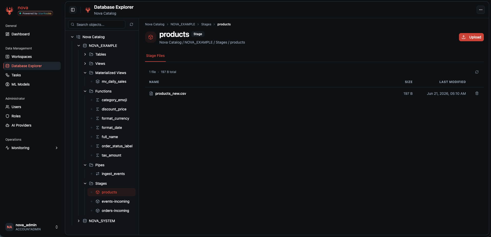
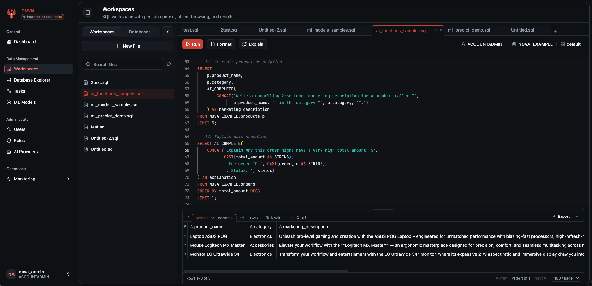
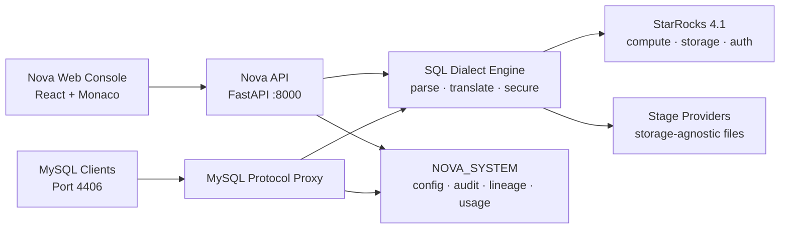

<div align="center">
  

  # Nova

  ### The data warehouse and AI platform powered by StarRocks

  Run analytics, manage data, work with files, and build AI-powered workflows
  through one fast, secure, and storage-agnostic platform.

  [](https://www.starrocks.io/)
  [](backend/)
  [](frontend/)
  [](backend/pyproject.toml)

  [Quick start](#quick-start) · [Architecture](#architecture) · [Documentation](#documentation)
</div>

---

## One platform. From raw files to intelligent products.

Nova brings a Snowflake-grade management experience to StarRocks without hiding
the engine that makes it fast.

Instead of stitching together separate tools for SQL, object storage, access
control, observability, ML, and AI, Nova exposes them through a consistent web
console, API, SQL dialect, and MySQL-compatible interface.

```sql
-- Query a staged file without exposing its storage provider or credentials.
SELECT *
FROM @production.sales.orders.parquet
WHERE order_date >= CURRENT_DATE - INTERVAL 7 DAY;
```

Nova resolves the stage, detects the file format, injects credentials securely,
translates the query into StarRocks SQL, and records the action in the audit log.

## Why Nova?

| Capability | What Nova provides |
|---|---|
| **Fast analytics** | StarRocks-powered real-time OLAP and interactive SQL |
| **Unified workspace** | SQL worksheet, catalog exploration, data management, and monitoring |
| **Stage-native files** | Storage-agnostic file access through the sacred `@stage` syntax |
| **Native security** | StarRocks users and grants remain the source of truth |
| **Credential isolation** | Storage and user credentials never appear in UI state, API responses, logs, or system tables |
| **MySQL compatibility** | Connect existing MySQL clients through Nova's protocol proxy |
| **Built-in intelligence** | ML workflows and SQL-native AI functions such as `AI_COMPLETE` and `AI_SENTIMENT` |
| **Operational visibility** | Audit history, query analytics, lineage, quality statistics, and cluster insights |

## The Nova experience

### Query everything

Use a Monaco-powered SQL workspace for tables, views, staged files, external
catalogs, ML models, and AI functions.

```sql
SELECT
    customer_id,
    AI_SENTIMENT(review_text) AS sentiment
FROM analytics.customer_reviews;
```

### Treat files like data

Stages provide one stable abstraction over S3-compatible storage, Azure, GCS,
and future providers. Users work with stage names—not endpoints, buckets, or
credentials.

```sql
SELECT * FROM @raw.events.2026.06.18.json;
```

### Bring your existing tools

Nova's MySQL protocol proxy lets compatible SQL clients connect on port `4406`
while preserving Nova's dialect translation, access checks, and audit trail.

### Build intelligence into SQL

Nova extends the warehouse with approachable ML and AI primitives:

```sql
CREATE ML_MODEL order_amount_regression
TYPE = REGRESSION
TARGET = total_amount
ALGORITHM = linear
TEST_SIZE = 0
AS SELECT
  CAST(order_id AS DOUBLE) AS order_id,
  CAST(customer_id AS DOUBLE) AS customer_id,
  CAST(total_amount AS DOUBLE) AS total_amount
FROM orders;
```

## Nova custom SQL dialect

Nova supports a small SQL dialect on top of StarRocks. Some commands are
native StarRocks SQL, while others are intercepted by Nova before they reach
StarRocks.

Run custom Nova SQL from the SQL Workspace or through the Nova Query API:

```http
POST /api/v1/query/execute
```

Do not send Nova-only syntax directly to StarRocks on port `9030`. Direct
StarRocks connections do not understand commands such as `CREATE ML_MODEL` or
`@stage` references and will return parser errors such as:

```text
No viable statement for input 'CREATE ML_MODEL'
```

### What is custom?

| Feature | Where it works | What Nova does |
|---|---|---|
| `CREATE ML_MODEL ... AS SELECT ...` | SQL Workspace, Query API | Intercepts the DDL, runs Python ML training, stores metadata and model versions in `NOVA_SYSTEM` |
| `@stage.path.file` | SQL Workspace, Query API | Resolves the stage, detects file format, injects credentials, rewrites to StarRocks `FILES(...)` |
| `AI_COMPLETE`, `AI_SENTIMENT`, `AI_CLASSIFY`, etc. | SQL Workspace after AI functions are registered | Nova manages StarRocks global UDFs and provider aliases |
| `ML_PREDICT` / prediction APIs | ML API, optionally SQL UDF when configured | Uses registered model aliases and stored model versions |

### 1. Train ML from the SQL Workspace

Nova v1 supports classical `REGRESSION` and `CLASSIFICATION` models from
worksheet SQL. The training query must return the target column and numeric
feature columns. The training data is read using the logged-in StarRocks user,
so normal StarRocks RBAC still applies.

Use database context `NOVA_EXAMPLE` for the seeded demo data.

Regression example:

```sql
CREATE ML_MODEL demo_order_amount_regression
TYPE = REGRESSION
TARGET = total_amount
ALGORITHM = linear
TEST_SIZE = 0
AS SELECT
  CAST(order_id AS DOUBLE) AS order_id,
  CAST(customer_id AS DOUBLE) AS customer_id,
  CAST(total_amount AS DOUBLE) AS total_amount
FROM orders;
```

Classification example:

```sql
CREATE ML_MODEL demo_order_status_classifier
TYPE = CLASSIFICATION
TARGET = status
ALGORITHM = decision_tree
TEST_SIZE = 0
AS SELECT
  CAST(order_id AS DOUBLE) AS order_id,
  CAST(customer_id AS DOUBLE) AS customer_id,
  CAST(total_amount AS DOUBLE) AS total_amount,
  status
FROM orders;
```

Supported clauses:

| Clause | Required | Example | Notes |
|---|---:|---|---|
| `TYPE` | Yes | `TYPE = REGRESSION` | `REGRESSION` or `CLASSIFICATION` |
| `TARGET` | Yes | `TARGET = total_amount` | Must be present in the `SELECT` output |
| `ALGORITHM` | No | `ALGORITHM = random_forest` | `auto`, `linear`, `logistic`, `decision_tree`, `random_forest`, `gradient_boost`, `knn`, `svm` |
| `TEST_SIZE` | No | `TEST_SIZE = 0.2` | Use `0` for tiny demo datasets |
| `FEATURES` | No | `FEATURES = (order_id, customer_id)` | Defaults to all columns except target |
| `HYPERPARAMETERS` | No | `HYPERPARAMETERS = JSON '{"n_estimators": 50}'` | Must be a JSON object |
| `AS SELECT` | Yes | `AS SELECT ... FROM orders` | Supplies the training data |

The worksheet returns one result row with:

```text
model_id, model_name, model_type, algorithm, version, status,
training_rows, feature_columns, metrics
```

The model is stored in:

```sql
SELECT model_id, model_name, model_type, target_column, feature_columns, created_at
FROM NOVA_SYSTEM.ML_MODELS
ORDER BY created_at DESC;
```

Model versions and metrics are stored in:

```sql
SELECT m.model_name, v.version, v.status, v.training_rows, v.metrics, v.created_at
FROM NOVA_SYSTEM.ML_MODELS m
JOIN NOVA_SYSTEM.ML_MODEL_VERSIONS v ON m.model_id = v.model_id
ORDER BY v.created_at DESC;
```

### 2. Use trained ML models

The reliable v1 path for prediction is the ML API. First create an alias for a
model version:

```bash
export NOVA_TOKEN="$(
  curl -s http://localhost:8000/api/v1/auth/login \
    -H "Content-Type: application/json" \
    -d '{"username":"root","password":""}' \
  | python -c 'import json,sys; print(json.load(sys.stdin)["access_token"])'
)"
```

```bash
curl -X POST http://localhost:8000/api/v1/ml/aliases \
  -H "Authorization: Bearer $NOVA_TOKEN" \
  -H "Content-Type: application/json" \
  -d '{
    "alias_name": "order_amount_predictor",
    "model_id": "<model_id from worksheet result>",
    "version": 1
  }'
```

Single prediction:

```bash
curl -X POST http://localhost:8000/api/v1/ml/predict \
  -H "Authorization: Bearer $NOVA_TOKEN" \
  -H "Content-Type: application/json" \
  -d '{
    "model_alias": "order_amount_predictor",
    "features": {
      "order_id": 1016,
      "customer_id": 5
    }
  }'
```

Batch prediction from SQL:

```bash
curl -X POST http://localhost:8000/api/v1/ml/predict/batch \
  -H "Authorization: Bearer $NOVA_TOKEN" \
  -H "Content-Type: application/json" \
  -d '{
    "model_alias": "order_amount_predictor",
    "prediction_sql": "SELECT CAST(order_id AS DOUBLE) AS order_id, CAST(customer_id AS DOUBLE) AS customer_id FROM NOVA_EXAMPLE.orders LIMIT 5",
    "database_name": "NOVA_EXAMPLE"
  }'
```

`ML_PREDICT(...)` exists as a Nova-managed UDF surface, but deployments may
return a helper message until the runtime UDF is configured. Use the API path
above for guaranteed v1 predictions.

### 3. Query staged files with `@stage`

`@stage` is a Nova abstraction over storage. Users see stage names and paths,
not buckets, endpoints, or credentials.

```sql
SELECT *
FROM @production.sales.orders.parquet
WHERE order_date >= CURRENT_DATE - INTERVAL 7 DAY;
```

Nova rewrites the query to a StarRocks `FILES(...)` call with the correct path,
format, and credentials. The original credentials never appear in UI state,
API responses, logs, or `NOVA_SYSTEM` tables.

Common patterns:

```sql
-- Read a CSV file from a stage.
SELECT *
FROM @demo_stage.imports.orders.csv;

-- Create a StarRocks table from staged data.
CREATE TABLE imported_orders AS
SELECT *
FROM @demo_stage.imports.orders.csv;

-- Join staged data with a managed table.
SELECT o.order_id, o.total_amount, c.first_name
FROM @demo_stage.imports.orders.csv o
JOIN customers c ON o.customer_id = c.customer_id;
```

### 4. Use AI functions in SQL

Nova manages AI provider configuration and StarRocks global UDFs for common LLM
tasks. Configure providers and function aliases in the AI Providers UI, then
register or re-register the UDFs from the Functions tab.

Available function surfaces include:

```sql
SELECT AI_COMPLETE('Write a haiku about databases') AS result;

SELECT AI_SENTIMENT('I love this product') AS sentiment;

SELECT AI_CLASSIFY(
  'The customer needs help with an invoice',
  'billing, technical, account, sales'
) AS category;

SELECT AI_SUMMARIZE(
  'StarRocks is a high-performance analytical database for real-time workloads...'
) AS summary;

SELECT AI_EXTRACT(
  'Jane Doe lives in Jakarta and works as a data engineer.',
  'name, city, occupation'
) AS extracted_json;

SELECT AI_TRANSLATE('Good morning', 'Indonesian') AS translated_text;

SELECT AI_FILTER(
  'The order was delayed and the customer is unhappy.',
  'is this a support escalation?'
) AS should_escalate;
```

If an AI function returns a configuration error, create or update its alias in
the AI Providers page and re-register UDFs. The provider API key is resolved by
Nova and must not be embedded in worksheet SQL.

## Screenshots

### Database Explorer



### Workspaces



## Architecture


```mermaid
flowchart LR
    UI["Nova Web Console<br/>React + Monaco"]
    CLIENT["MySQL Clients<br/>Port 4406"]
    API["Nova API<br/>FastAPI :8000"]
    PROXY["MySQL Protocol Proxy"]
    PIPELINE["SQL Dialect Engine<br/>parse · translate · secure"]
    SR["StarRocks 4.1<br/>compute · storage · auth"]
    STAGE["Stage Providers<br/>storage-agnostic files"]
    SYSTEM["NOVA_SYSTEM<br/>config · audit · lineage · usage"]

    UI --> API
    CLIENT --> PROXY
    API --> PIPELINE
    PROXY --> PIPELINE
    PIPELINE --> SR
    PIPELINE --> STAGE
    API --> SYSTEM
    PROXY --> SYSTEM
```

### Core design principles

1. **StarRocks is the source of truth.** Nova does not maintain a separate user database.
2. **Credentials are invisible.** Secrets stay in configuration or encrypted session memory.
3. **The UI is storage-agnostic.** Provider-specific infrastructure never leaks into the user experience.
4. **`@stage` is a first-class SQL primitive.** File access always flows through the dialect engine.
5. **Persistent state belongs in `NOVA_SYSTEM`.** Nova does not introduce SQLite or PostgreSQL.
6. **Every meaningful action is auditable.**
7. **`ACCOUNTADMIN` is immutable.** The system's highest-privilege role cannot be dropped or revoked.

## Quick start

### Prerequisites

- Docker with Docker Compose
- Python 3.11+ and [uv](https://docs.astral.sh/uv/)
- Node.js with [pnpm](https://pnpm.io/)
- A MySQL client for direct engine access

### 1. Start the engine

```bash
cd docker
cp .env.example .env
docker compose -f docker-compose-engine.yml up -d
```

Verify the infrastructure:

```bash
docker compose -f docker-compose-engine.yml ps
curl http://localhost:8030/api/health
```

### 2. Start the backend

```bash
cd backend
cp .env.example .env
uv sync
uv run uvicorn app.main:app --reload --port 8000
```

Backend endpoints:

- API: [http://localhost:8000](http://localhost:8000)
- OpenAPI: [http://localhost:8000/docs](http://localhost:8000/docs)
- Health: [http://localhost:8000/health](http://localhost:8000/health)

### 3. Start the frontend

```bash
cd frontend
pnpm install
pnpm dev
```

Open [http://localhost:5173](http://localhost:5173).

### 4. Connect directly to StarRocks

```bash
mysql -h 127.0.0.1 -P 9030 -u nova_admin -p
```

The development password is `nova`. Change it after the first login.

> Never expose the passwordless StarRocks `root` user outside the internal
> Docker network.

## Local services

| Service | Address | Purpose |
|---|---|---|
| Nova Web | `localhost:5173` | React application |
| Nova API | `localhost:8000` | FastAPI backend |
| Nova MySQL Proxy | `localhost:4406` | Nova-aware MySQL protocol |
| StarRocks FE HTTP | `localhost:8030` | Engine API and health |
| StarRocks MySQL | `localhost:9030` | Direct development connection |
| StarRocks BE HTTP | `localhost:8040` | Backend node API |
| Object Storage API | `localhost:9000` | Local stage storage |
| Object Storage Console | `localhost:9001` | Local storage administration |
| Redis | `localhost:6379` | Sessions and query cache |

## Technology

| Layer | Stack |
|---|---|
| Query engine | StarRocks 4.1 |
| Backend | Python 3.11, FastAPI, Pydantic, async MySQL |
| Frontend | React 19, TypeScript, Vite, Tailwind CSS, shadcn/ui |
| SQL workspace | Monaco Editor |
| State and data | Zustand, TanStack Query, TanStack Router |
| Infrastructure | Docker Compose, Redis, S3-compatible local storage |
| Testing | Pytest, Vitest, Playwright |

## Project structure

```text
nova/
├── backend/              # FastAPI application and domain modules
│   ├── app/
│   │   ├── core/         # Configuration, security, database, Redis
│   │   ├── modules/      # Auth, query, objects, stages, users, AI/ML
│   │   └── common/       # Shared NOVA_SYSTEM infrastructure
│   └── tests/
├── frontend/             # React application
│   ├── public/images/    # Nova brand assets
│   └── src/              # Routes, features, components, state
├── docker/               # StarRocks and local infrastructure
├── docs/                 # Product and architecture specifications
├── AGENTS.md             # Engineering rules for AI agents
└── README.md
```

## Documentation

The [`docs/`](docs/) directory contains the detailed product specification:

- **27 feature modules** covering SQL, stages, governance, ML, dashboards,
  cluster operations, backup, indexes, and data sharing.
- **7 architecture documents** for the SQL dialect, storage providers,
  backend, frontend, system database, and MySQL proxy.
- **Gap analysis** tracking parity targets and remaining platform work.

Start with:

- [Platform overview](docs/01-overview.md)
- [SQL worksheet](docs/02-sql-worksheet.md)
- [Stage manager](docs/04-stage-manager.md)
- [Machine learning](docs/19-machine-learning.md)
- [SQL dialect architecture](docs/arch-01-sql-dialect-engine.md)
- [Backend architecture](docs/arch-03-backend-architecture.md)

## Development checks

Backend:

```bash
cd backend
uv run pytest
uv run ruff check .
```

Assistant benchmarks (offline, deterministic; the `-s` shows the numbers):

```bash
cd backend
uv run pytest tests/benchmark -q -s -m "not engine"
uv run pytest tests/benchmark -q -s -m engine   # needs the Docker test stack
```

See [docs/benchmarks/nova-61-assistant.md](docs/benchmarks/nova-61-assistant.md).

Frontend:

```bash
cd frontend
pnpm lint
pnpm test
pnpm build
```

## Status

Nova is under active development. The architecture and product specifications
describe the target platform; individual modules may be implemented
incrementally.

> **Documentation vs implementation — known discrepancy.** `AGENTS.md`
> ("Project Structure") describes the backend layout as `app/core/`, `app/db/`,
> `app/models/`, `app/schemas/`, `app/services/`, `app/sql_dialect/`,
> `app/storage/`, `app/proxy/`, `app/api/v1/endpoints/`. The repository does not
> use that layout: only `app/core/` and `app/common/` exist as shared packages,
> and all domain code lives in `app/modules/<domain>/` (routers, services,
> schemas colocated per module, registered in `app/main.py`). `app/proxy/` does
> not exist at all — see Phase 8. `AGENTS.md` and this README have not been
> reconciled; treat `app/modules/` as the real layout until `AGENTS.md` is
> updated.

Roadmap checkboxes below are marked only where the code in this repository
proves the item; each line cites its evidence. Lines marked `[ ]` that have
partial implementation say so explicitly.

## Roadmap

### Phase 1 — Foundation & Auth ✅
- [x] Docker infrastructure (StarRocks FE/BE, MinIO, Redis) — `docker/docker-compose-engine.yml` (starrocks/fe-ubuntu:4.1.4, be-ubuntu:4.1.4, minio, redis:7-alpine). **Engine pin bumped 4.1.1 → 4.1.4 (NOVA-51, commit `4a9848e`)**; see the migration note in `HOW_TO_RUN.md` for the Parquet `isAdjustedToUTC=false` timestamp behaviour change
- [x] FastAPI modular monolith with asyncmy driver — `backend/app/main.py`, `backend/app/core/database.py:6` (`import asyncmy`)
- [x] JWT + Redis session management — `backend/app/core/redis.py`, `backend/app/modules/auth/service.py`
- [x] StarRocks-native authentication (first-login setup wizard) — `backend/app/modules/auth/{router,service}.py`; the frontend implements this as a **setup form inside sign-in**, not a separate wizard route (`frontend/src/features/auth/sign-in/components/user-auth-form.tsx:29,88,147`)
- [x] ACCOUNTADMIN role guard (immutable super user) — `backend/app/common/sql_guard.py`, `backend/app/core/{deps,exceptions}.py`, `backend/app/modules/users/service.py`
- [x] NOVA_SYSTEM database initialization (CONFIG, AUDIT) — `docker/init-nova.sql:50-390`, `backend/app/common/nova_system.py`. **Note:** the SQL uses flat `NOVA_SYSTEM.CONFIG_*` / `ML_*` / `AUDIT_*` tables; `AGENTS.md` documents a nested schema layout (`CONFIG.STAGES`, `AUDIT.LOG`) that the code does not use
- [x] Frontend: Sign-in page (split-screen), auth guard, JWT cookie — `frontend/src/features/auth/sign-in/sign-in-2.tsx` (`lg:grid-cols-2`), `frontend/src/routes/_authenticated/route.tsx`

### Phase 2 — Query Engine 🔶
- [x] SQL execution via asyncmy per-user connections — `backend/app/modules/query/service.py`, `backend/app/core/database.py:63-71`
- [ ] @stage SQL dialect — **parse stage is ANTLR4 as of 109-B (NOVA-126, branch unmerged)**: `backend/app/modules/query/dialect/parser.py` builds the stage registry from the grammar's `stageReference` nodes (109-A / NOVA-125) instead of `_STAGE_PATTERN` / `_AT_TOKEN` regexes; `detect_command_type` reads the statement node plus the leading tokens. The five parse defects this slice owns are closed, each with a `line:col` regression test (`backend/tests/unit/test_nova126_antlr_stage_parse.py`): slash path `@stage1/folder/x.csv`, glob `@stage1.data/*.csv`, `@@version`, `@stage` in a comment/literal, and exact error positions. Two further fixes the swap required: the lexer input now folds case (`CaseInsensitiveInputStream`) because the vendored Python lexer is case-sensitive while StarRocks keywords are not, and a dotted `@name` in an **expression** list (`SELECT @stage1.data.csv`, no `FROM`) is no longer a false-positive stage — the grammar only admits a stage in table position, which is the correct reading. **Numeric dotted paths (NOVA-132)** are handled by a Nova-block grammar rule (`fusedDecimal`) plus node-driven segment recovery in `parser.py`: the lexer fuses a separator onto a following number (`.2024`), which used to drop the whole reference and forward the statement untranslated. `@stage1.2024.csv`, `@stage1.2024.01.data.csv`, `@stage1.folder.2024.csv`, `@stage1.data.2024.csv`, `@stage1.2.csv`, the exponent form `@stage1.2e3.csv`, and the `DOT_IDENTIFIER` form `@stage1.2024_01.csv` now resolve exactly as the regex parser did; a trailing numeric segment no longer swallows a table alias (`FROM @stage1.2024 t`), and the `LIST`/`COPY INTO` token scan expands the same fused tokens. **Reserved-keyword path segments and the trailing-dot hyphen form (NOVA-109 review, 2026-09-18)** are the two further regressions the review caught against the regex baseline and are now fixed: the upstream `identifier` rule accepts only `nonReserved`, so a segment spelled as a reserved keyword (`@stage1.data.default.csv`, `…/order/…`, `…/group/…`, `…/primary/…`) failed `stagePathAtom` and the statement was forwarded untranslated — a Nova-only `stagePathKeyword` rule scoped to `stagePathAtom` now accepts the reserved-keyword token classes (not widening `identifier`, so aliases and user variables are unchanged); and a fused `2.` token in `@stage-2.data.csv` absorbed the following atom into one segment, so the name read as `stage-2.data` — the fused `.` is now split as the separator it is, matching the `main` baseline. Both are pinned by end-to-end `parse_sql` regression tests asserting `command_type`/`stage_refs` (`backend/tests/unit/test_nova126_antlr_stage_parse.py`), not the SQL string. Prior state (kept for the record): **downgraded from `[x]` by NOVA-17** (audit on `237a64b`, re-confirmed at `f29c449`) for `_normalize_default_schema_qualification` corrupting `@stage1.data.default.csv` / `config.default.value` (fixed by 109-C / NOVA-124) and `CREATE ML_MODEL ... TYPE = FORECAST` (fixed by 109-C); `training_sql` was closed by NOVA-64 (`ml_engine/service.py:148-153` calls `:717,725`). **Latency gate (NOVA-126 AC-5, precondition D1) now PASSES via the `@`-free short-circuit (Option B, 2026-09-19)**: the ANTLR4 parse is ~160× the regex it replaces, so `parse_sql` returns `REGULAR`/`stage_refs=[]` without building a tree when the statement contains no literal `@`. A stage always contains `@`, so the guard is sound. Ordinary SQL p50/p95 is **0.3 µs / 0.4 µs** (regex before: 3.1 µs / 4.3 µs; unmitigated ANTLR: 418 µs / 2342 µs). Stage SQL (`@` present) pays the grammar cost — 324 µs / 584 µs — which is the price of one parse source of truth for the only statement class the dialect rewrites. Statements carrying `@` that are not stages (`@@version`, `@` in a literal, user variables) still go through the grammar, so the tree remains the single source of truth for every statement that can carry a stage.

- [x] File format auto-detection (CSV, Parquet, JSON, ORC, Avro) — `backend/app/modules/query/dialect/detector.py:13-14` (magic bytes) + `parser.py` (`_FILE_EXTENSIONS`)
- [x] Query history with audit logging — `backend/app/modules/query/repository.py`, `backend/app/common/audit.py` (14 call sites)
- [x] Destructive SQL guard (DROP, TRUNCATE, DELETE confirmation) — `backend/app/common/sql_guard.py`, `backend/app/modules/query/service.py:94`
- [x] Frontend: Monaco editor, results table, multi-tab, Ctrl+Enter — `frontend/src/features/workspaces/index.tsx`

### Phase 3 — Object Browser ✅
- [x] Catalog → Database → Schema → Table/View/MV/Function tree — `backend/app/modules/explorer/router.py`, `frontend/src/features/database-explorer/index.tsx` (`buildCatalogTree`, 2667 lines)
- [x] SHOW / DESCRIBE / INFORMATION_SCHEMA queries — `backend/app/modules/objects/router.py`, `.../explorer/router.py`
- [x] Table column metadata with types — `backend/app/modules/objects/router.py:160`
- [x] Schema browser in sidebar (DatabaseExplorer) — `frontend/src/components/layout/data/sidebar-data.ts` ("Database Explorer")
- [x] Frontend: Object browser panel, schema pre-loading — `frontend/src/features/database-explorer/index.tsx`

### Phase 4 — Stage & Storage 🔶
- [x] Storage provider abstraction (S3/MinIO) — `backend/app/core/config.py` + `backend/app/modules/stages/service.py` (boto3/S3 client)
- [x] Stage CRUD registered in `NOVA_SYSTEM.CONFIG_STAGES` — `backend/app/modules/stages/{router,service}.py`
- [x] File operations: browse, upload, download, delete — `backend/app/modules/stages/router.py:80-140`
- [ ] CTAS from stage, export to stage — dialect support only, and **not end-to-end proven**: `COPY INTO` load/export is classified as `STAGE_LOAD` / `STAGE_EXPORT` (`backend/app/modules/query/dialect/parser.py`, `CommandType` + `detect_command_type`) and the `@stage` reference is rewritten to `FILES()` (`.../dialect/translator.py:92`), covered by unit tests (`backend/tests/unit/test_dialect.py:63-69`). But there is no dedicated UI and no end-to-end integration test that runs a real load/export against the engine; `COPY INTO` option syntax is unverified (see `docs/sql_docs/10-starrocks-reference-comparison.md:112`). Lowered from `[x]` by NOVA-112 to match that evidence
- [ ] Schema-bound access control (RBAC on stage files) — stage records carry `database_name` / `schema_name`, but no privilege check is enforced in `backend/app/modules/stages/service.py`
- [x] NOVA_DEMO sample database (customers, orders, order_items) — `docker/init-nova.sql:401-460`. **Note:** `products` lives in `NOVA_CATALOG.products` (`docker/init-nova.sql:494-497`), not in `NOVA_DEMO`
- [ ] Stage Manager page — no `frontend/src/features/stages/`; only the database-explorer tree can create/list stage files (`frontend/src/features/database-explorer/index.tsx`)

### Phase 5 — Administration 🔶
- [x] User management (create, alter, drop, password reset) — `backend/app/modules/users/router.py:44-240`, UI `frontend/src/features/users/`
- [x] Role management (create, drop, grant, set default) — `backend/app/modules/users/router.py:253-369`, UI `frontend/src/features/roles/`
- [x] RBAC enforcement via StarRocks SHOW GRANTS — `backend/app/modules/users/router.py:144`, `backend/app/core/deps.py`
- [x] Workspace file persistence (save/load/query files) — `backend/app/modules/workspaces/{router,service}.py`, UI `frontend/src/features/workspaces/`
- [ ] Resource groups (CPU/memory quotas, classifiers) — `backend/app/modules/resource_groups/` is an empty stub
- [ ] Cluster monitor (FE/BE/CN nodes, health checks) — only a metrics endpoint exists (`backend/app/modules/monitoring/router.py:223`); no node/health management. Not to be confused with the monitoring **pages** under Phase 7
- [x] Function manager (UDF: SQL, Java, Python) — `backend/app/modules/functions/`, registered `backend/app/main.py:118`, UI `frontend/src/features/functions/`
- [x] Task manager (SUBMIT TASK, scheduling) — `backend/app/modules/tasks/router.py`, registered `backend/app/main.py:119`, UI `frontend/src/features/tasks/`
- [x] Pipe manager (continuous ingestion, AUTO_INGEST) — `backend/app/modules/pipes/router.py`, registered `backend/app/main.py:120`, UI `frontend/src/features/pipes/`

### Phase 6 — Advanced Features 🔶
- [x] AI Provider management (OpenAI, Anthropic, openai-compatible) — `backend/app/modules/ai_ml/router.py`, UI `frontend/src/features/ai-providers/`
- [x] ML model registry (classification, regression; 8 algorithms) — `backend/app/modules/ml_engine/service.py`, tables `NOVA_SYSTEM.ML_MODELS` / `ML_MODEL_VERSIONS` / `ML_MODEL_ALIASES` (`docker/init-nova.sql:204-234`). **Note:** `forecast` and `anomaly_detection` are accepted as `model_type` values (`backend/app/modules/ml_engine/schemas.py:15-21`) and trained with the regression/classification estimator families respectively; a dedicated time-series forecaster (ARIMA/ETS) is not yet implemented, so `ML_FORECAST(...)` from `docs/19-machine-learning.md` still has no backend
- [x] AI SQL functions (AI_COMPLETE, AI_SENTIMENT, AI_SUMMARIZE, AI_TRANSLATE, …) — `backend/app/modules/llm_functions/service.py:34-64`, registered as StarRocks UDFs (`service.py:372-377`)
- [x] External catalogs (Hive + Iceberg, GA-only) — backend module implemented and registered (`backend/app/modules/external_catalogs/service.py:124-177` builds `CREATE` / `ALTER` / `DROP`; `router.py:40-131` exposes CRUD + external-table listing; mounted at `backend/app/main.py:179`, schema ensured at `:70-72`), frontend at `frontend/src/features/external-catalogs/`, tests at `backend/tests/unit/test_external_catalogs.py` + `backend/tests/integration/test_external_catalogs_l3.py`. Paimon / JDBC / Delta Lake are **not** implemented — `CatalogType` accepts only `hive\|iceberg` (`.../external_catalogs/schemas.py:20-24`)
- [ ] Dashboards (charts, widgets, auto-refresh) — `backend/app/modules/dashboards/` is an empty stub; tables only (`NOVA_SYSTEM.CONFIG_DASHBOARDS`, `CONFIG_DASHBOARD_WIDGETS`, `docker/init-nova.sql:152-163`)
- [ ] Backup & restore (snapshots, point-in-time, recycle bin) — `backend/app/modules/backup/` is an empty stub
- [ ] Data governance (masking policies, row access, tagging, lineage) — `backend/app/modules/governance/` is an empty stub; `NOVA_SYSTEM.CONFIG_OBJECT_TAGS` and `LINEAGE_LOAD_HISTORY` tables exist unused
- [ ] Variables & settings (session/global browser, password policies) — `backend/app/modules/variables/` is an empty stub
- [ ] Compaction manager (manual trigger, score monitoring)
- [ ] Storage volumes (shared-data mode)
- [ ] Data sharing (shared views, shared stages, API endpoints)
- [ ] Data loading (Stream Load, Broker Load, Routine Load) — the Pipe manager (Phase 5) covers continuous ingestion; bulk load paths are not implemented
- [ ] Data export (INSERT INTO FILES, partitioned unload)

### Phase 7 — Frontend Pages 🔶
- [x] Auth: Sign-in (split-screen), first-login setup form, role switcher — `frontend/src/features/auth/sign-in/sign-in-2.tsx` (`lg:grid-cols-2`), `.../components/user-auth-form.tsx:29,88,147` (setup form), `frontend/src/routes/_authenticated/index.tsx`
- [x] SQL Workspace: Monaco editor, results panel, tabs — `frontend/src/features/workspaces/index.tsx`
- [x] Sidebar: Object browser, workspace tree — `frontend/src/components/layout/data/sidebar-data.ts`
- [x] Appearance: Light/Dark/System themes — `frontend/src/components/theme-switch.tsx:34,41,48`
- [ ] Stage Manager page — a Stage Manager page does not exist; stage files are only reachable from the database-explorer tree (`frontend/src/features/database-explorer/index.tsx`). Moving this outside Phase 4 means this item stays `[ ]`
- [x] User & Role Management page — `frontend/src/features/users/` (20 files), `frontend/src/features/roles/`, routes `frontend/src/routes/_authenticated/users/` + `.../roles/`
- [x] AI Providers page — `frontend/src/features/ai-providers/`, route `frontend/src/routes/_authenticated/ai-providers/`
- [ ] Cluster Monitor page — **ambiguous**: there is no node/health page, but 6 monitoring pages exist (`frontend/src/features/monitoring/` — query history, active queries, audit trail, tasks, query cost, data loads; routes `frontend/src/routes/_authenticated/monitoring/`). Leave `[ ]` with a pointer rather than claiming the Phase 5 cluster monitor
- [x] Monitoring pages (query history, active queries, audit trail, tasks, query cost, data loads) — `frontend/src/features/monitoring/`, `frontend/src/routes/_authenticated/{query-history,active-query,query-cost,monitoring/*}.tsx`
- [ ] Dashboards page — `frontend/src/features/dashboard/` exists but is the Home dashboard (5 files); no dashboard CRUD/builder page
- [ ] Admin Settings page
### Phase 8 — MySQL Protocol Proxy 🔶
`backend/app/proxy/` exists and serves a real client. The `mysql` 8.0.46 CLI
connects to port 4406, authenticates against StarRocks, and runs `SELECT`,
`SHOW DATABASES`, `USE`, `SET` and `@stage` queries — verified end to end in
`backend/tests/integration/test_mysql_proxy_cli.py`. Documentation:
`backend/app/proxy/README.md`.

- [x] TCP listener on port 4406 — `backend/app/proxy/server.py`; embedded in the FastAPI lifespan (`backend/app/main.py:75`) and runnable standalone via `python -m app.proxy`
- [x] MySQL wire protocol parser — `backend/app/proxy/protocol.py` (framing, handshake, OK/ERR/EOF, result sets; engine-free)
- [x] @stage dialect translation in proxy layer — routed through `QueryService.execute_statements` (`backend/app/proxy/executor.py`), so the proxy reuses the pipeline rather than reimplementing it
- [x] User variables — `SET @x = …` is tracked per connection and `@x` is substituted into later statements (`backend/app/proxy/session.py`); a bare `@name` is no longer claimed as a stage reference (`backend/app/modules/query/dialect/parser.py`)
- [x] Credential injection for @stage queries — same `QueryService` path; credentials are redacted in results, audit rows and error text
- [x] Audit logging for proxy queries — every statement lands in `NOVA_SYSTEM.AUDIT_LOG` via `QueryService`
- [x] Authentication — StarRocks challenge relay (`backend/app/proxy/auth.py`); the proxy never holds a password
- [ ] Connection pooling and session tracking — not implemented. Each client connection holds one upstream StarRocks session; there is no pool. Per-connection `SET`/`USE` tracking exists (`backend/app/proxy/session.py`), but richer session state is not carried
- [ ] Prepared statements (`COM_STMT_PREPARE`) — refused with `ER_NOT_SUPPORTED_YET` so drivers fall back to the text protocol

### Phase 9 — Task Orchestration & Scheduler (9a complete, NOVA-23)
Stage 9a is complete and merged; 9b (`CREATE TASK` grammar/lowering/runtime + task graph UI, PRs #57, #60, #61, #62, #64, #65) is complete and merged; 9c stream providers is not started. Product decisions
E1–E3 were confirmed on 2026-09-17. Design is **decided and written down**:
see `docs/specs/nova-23-task-orchestration-design.md`.
Orchestration layer **above** the existing native task manager
(`backend/app/modules/tasks/`, Phase 5) — not an extension of it. The native
manager covers `SUBMIT TASK` / `ALTER TASK` / `DROP TASK` and run listing; this
phase adds cron, DAG dependencies, SQL-defined tasks, a separate scheduler/worker
engine, and Nova-owned run metadata.

Design decisions taken (D9.1–D9.8, rationale + criteria in the design doc):
Nova owns the cron/DAG engine rather than adopting a workflow framework; two
processes (`nova-scheduler` singleton + `nova-worker` fan-out) over Redis Streams
with `NOVA_SYSTEM` as the only source of truth; the Snowflake-superset
`CREATE TASK` surface — a **Nova grammar surface, not an engine statement**
(the pinned 4.1.4 engine has only `SUBMIT TASK`; the 9b patch adds `CREATE TASK` and lowers it);
**delegate-first** authorization (submit `SUBMIT TASK` on
the owner's own connection so StarRocks enforces RBAC); stream in a later stage with
all three providers, including `partition_change` on `SHOW PARTITIONS.VisibleVersion`;
run history snapshotted for graph state; and the `GET /tasks` root-connection RBAC
defect fixed inside this phase.

Staged delivery — 9a metadata + scheduler + worker + delegate-first execution;
9b `CREATE TASK` grammar patch + lowering + task graph UI; 9c stream providers.

- [x] **9a** Metadata tables + DAG validation in `NOVA_SYSTEM` (no credentials) — `docker/init-nova.sql:184-238` (`CONFIG_TASKS`, `CONFIG_TASK_EDGES`, `CONFIG_TASK_GRAPH_RUNS`, `CONFIG_TASK_RUNS`), `backend/app/modules/task_orchestration/{schemas,repository,graph}.py` (PR #37)
- [x] **9a** `nova-scheduler` process — Nova-owned cron/interval tick (`croniter`), separate from the FastAPI backend — `backend/app/scheduler/`, `HOW_TO_RUN.md` §4 (PR #40)
- [x] **9a** `nova-worker` process — executes graph nodes on the owner's connection (delegate-first) — `backend/app/worker/`, `HOW_TO_RUN.md` §5 (PR #46)
- [x] **9a** Redis Streams transport between scheduler and worker — `backend/app/modules/task_orchestration/transport.py` (PRs #40, #46)
- [x] **9a** Reconciliation of native task state ↔ `NOVA_SYSTEM` (poll `information_schema.task_runs`; handle the 10-consecutive-failure auto-pause) — `backend/app/modules/task_orchestration/{reconciler,native}.py` (PR #52)
- [x] **9a** Fix `GET /tasks` to connect as the caller, so the engine's privilege filter is not bypassed — `backend/app/modules/tasks/service.py` now takes an injected user connection (PR #39)
- [x] **9b** `CREATE TASK … AFTER / FINALIZE / WHEN / SCHEDULE` added to the existing ANTLR4 `submitTaskStatement` rule (NOVA-BEGIN/NOVA-END patch, `--fuzz=0`, CI drift check); it is a Nova surface, lowered to `SUBMIT TASK` — `backend/app/sql_dialect/grammar/StarRocks.g4` (pristine upstream copy under `backend/app/sql_dialect/grammar/upstream/`, guarded by `backend/scripts/check_grammar_drift.py`), `backend/app/modules/task_orchestration/lowering.py` (PRs #57, #60, #61, #62)
- [x] **9b** Task graph UI — read-only `GET /api/v1/task-orchestration` API (PR #64) plus the `/task-graphs` graph list → detail (nodes + `after`/`finalize` edges) → run history → node-run view (`frontend/src/features/task-orchestration/`)
- [ ] **9c** `has stream` — `mv_refresh` first, then `partition_change` (`SHOW PARTITIONS` + `VisibleVersion`, one full sweep per evaluation) and `load_event`

**Progress note (NOVA-35, 2026-09-18).** The `nova-scheduler` process and the
scheduler-side Redis Streams transport are implemented and tested in
`backend/app/scheduler/` + `backend/app/modules/task_orchestration/`
(`schedule.py`, `scheduler.py`, `transport.py`, `service.py`): IANA-timezone cron
and interval next-fire, leader-lock singleton, persist-before-publish ordering,
deterministic graph-run ids for idempotency, and one run per `A → B → [C, D]`
graph. The two checklist items above are checked now that PR #40 has merged; the
runbook is `HOW_TO_RUN.md` §4.

**Progress note (NOVA-36, 2026-09-18).** The `nova-worker` process is implemented
and tested in `backend/app/worker/` +
`backend/app/modules/task_orchestration/` (`dag.py`, `execution.py`,
`credentials.py`, `consumer.py`, `worker.py`, `worker_service.py`,
`reconciler.py`): the DAG state machine (parent-fail fails the graph, `WHEN`
false skips the subtree, suspend does not hang a join), delegate-first execution
that submits `SUBMIT TASK` on the **owner's** connection and polls
`information_schema.task_runs` for completion, conditional state transitions on
every node/graph write, consumer-group delivery with at-least-once redelivery,
and a reconciler that re-derives abandoned work from `NOVA_SYSTEM` alone.
Credentials are resolved per execution from the live session store and discarded
with the connection; nothing credential-shaped is written to `CONFIG_TASK*`,
the stream, or a log. Sixteen new unit tests and eighteen engine integration
tests cover the acceptance criteria; the runbook is `HOW_TO_RUN.md` §5.

**Progress note (NOVA-37, 2026-09-18).** Native-state reconciliation is
implemented as an **extension of the existing `Reconciler`** — there is no
second reconciler. `backend/app/modules/task_orchestration/native.py` reads
`information_schema.task_runs` for the nodes of running graph runs,
`information_schema.tasks.SCHEDULE` for the native pause marker, and
`ADMIN SHOW FRONTEND CONFIG LIKE '%task%'` for the FE config (not
`SHOW VARIABLES`); `Reconciler.reconcile_native` advances a settled node
(SUCCESS/FAILED), leaves a node with no native row or a failed read untouched,
and surfaces an **auto-pause** only at the real threshold — the
engine's `max_task_consecutive_fail_count` (read live as 10) crossed by Nova's
own persistent `CONFIG_TASKS.consecutive_fail_count` (reset on success), or a
native `SCHEDULE` pause/suspend marker — to `NOVA_SYSTEM.AUDIT_LOG`. A single
failure is quiet, so the alarm stays meaningful (NOVA-42). A native row older
than the node's `started_at` is ignored, so a stale attempt cannot fail a live
node. An **empty** read is `MISSING` only when a `SELECT 1` probe on the same
connection proves the engine is live, so a stale pooled connection after an FE
death cannot mark healthy work `abandoned` (NOVA-43). A **failed** read is
always `UNKNOWN` and writes nothing (NOVA-46): the archive failure behind it is
engine-wide — on a fresh FE the fresh-FE 1064 on `_statistics_.task_run_history`
fires for every `task_runs` read while ordinary statements still succeed — so it
carries no per-task information and no trace verdict may be drawn from it. The
same reasoning applies to a no-row read: `MISSING` maps to no state either
(NOVA-52), because a node that was just submitted (`SUBMIT TASK` sent, its
`task_runs` row not yet visible) would otherwise be settled `abandoned` while its
worker is alive. The lost trace is settled instead by the **durable heartbeat
path**: `Reconciler.abandon_stale_nodes` (driven by
`WorkerService.reconcile_once`) abandons a `running` node whose worker heartbeat
lapsed — a conditional write with a `NODE_ABANDONED` audit — from durable
`NOVA_SYSTEM` state, independent of the archive (design §3). It is the only
writer of `NODE_ABANDONED`. That is the "task was running when the FE/worker
died" scenario AC #2 targets, and it cannot fire on a healthy in-flight node.
`scan` stays a pure read that only reports candidates. Connection acquisition is inside
the observer's guard, so an unreachable engine degrades to `UNKNOWN` instead of
raising (NOVA-44). Criterion 7 is verified against the live engine, which
reports `task_runs_ttl_second = 604800` (7 days) — not the wrong 86400 premise.
Forty-two unit + eleven engine integration tests; the runbook is
`HOW_TO_RUN.md` §5. The checklist item above stays unchecked until this PR is
merged.

### Phase 10 — Agentic assistant (bounded) ✅

Purpose: give the SQL workspace a Coco-style assistant without committing to full
agent-platform parity. **This phase supersedes matrix row #20** in
`docs/roadmap-snowflake-parity.md`, which was `DEFER`/`NOT_APPLICABLE`; NOVA-61
(E3b, 2026-09-18) re-scoped it to the bounded subset below. It is **P1 but not
critical path** — it does not displace Phase 0 (#2/#9) or Phase 1.

**Decisions (NOVA-61, 2026-09-18):** E3b bounded subset · **E1a** assistant
executes read-only SQL itself with per-call approval · **E2b** `always allow` is
per conversation, in-memory, read-only · **E5a** conversations are in-memory only ·
**E4a** reuse `NOVA_SYSTEM.CONFIG_AI_PROVIDERS` · **E6a** no LLM trace storage.
Design contract: `docs/specs/nova-61-agentic-assistant-design.md`.

- [x] **10-A** Design spec pinned to E1a/E2b/E5a and the locked v1 subset — `docs/specs/nova-61-agentic-assistant-design.md` (PR #74)
- [x] **10-B** Backend assistant module `backend/app/modules/assistant/` — auth-required thread endpoints, provider wiring to `CONFIG_AI_PROVIDERS`, bounded plan→tool→reflect loop with the SSE event contract (`text_delta`, `tool_call`, `tool_status`, `done`, `error`, `ping`) — `router.py`, `service.py`, `provider.py`, `events.py`, `state.py`, `consent.py` (PR #77)
- [x] **10-C** `query_execute` tool — delegate-first via `QueryService.execute_statements` (never a socket, never port 9030), read-only allowlist layered above the unchanged `sql_guard.py`, per-call/always-allow/deny consent, audit correlation — `tools/query_execute.py`, `tools/policy.py`, `tools/redaction.py`; proven by `backend/tests/unit/test_assistant_stage_c.py` (no-socket import test, delegate-first test, deny-before-engine, consent IDOR→404, redacted audit SQL) (PR #83, NOVA-77)
- [x] **10-D** Assistant panel — right-side panel in the workspace `<section>` using `Bot` for the assistant surface, transcript + streaming + stop, inline tool-call card with approval controls, session management — `frontend/src/features/assistant/` (`assistant-panel.tsx`, `use-assistant-turn.ts`, `stream-client.ts`, `tool-call-card.tsx`); 322 frontend tests green (PRs #78, #81)
- [x] **10-E** SQL skill retrieval from `docs/sql_docs/` — advisory context only; invariant enforcement stays in `sql_guard.py` — `backend/app/modules/assistant/skills.py` (12 source docs, revision-hashed, token-budget enforced, credential-screened); proven by `backend/tests/unit/test_assistant_skill.py`. Blocker cleared: NOVA-59 landed, `docs/sql_docs/` is on `main`
- [x] **10-F** Measured benchmark for the loop, tool, consent and skill-assembly path + a committed report — `docs/benchmarks/nova-61-assistant.md` + `backend/tests/benchmark/` (`harness.py`, `test_assistant_loop.py`, `test_assistant_engine.py`) (NOVA-92, PR #98)

Explicitly out of v1 (with revisit triggers in the design spec §0.1): agent
frameworks, sidecar runtime, bypass-approvals mode, persistent grants,
browser/file tools, `CREATE TABLE`-by-prompt, dbt, notebooks,
`mcp-server-starrocks` as the tool path, query timeout/cancel, LLM trace storage.

## Decision Log

Durable decisions with their reason, trade-off, and the trigger that reopens them. Newest first.

### Internal ML endpoint authentication (NOVA-90) — 2026-09-18

| Decision | Reason | Trade-off accepted | Reopen trigger |
|---|---|---|---|
| **Keep `/api/v1/internal/ml/predict`; gate it by peer address + `X-Nova-Internal-Token` instead of deleting it** | The route has no Nova session-holder, so a JWT dependency cannot fit; a shared secret plus a code-enforced loopback/trusted-proxy check closes the unauthenticated hole while preserving a machine-to-machine path | The deployment must distribute one shared secret to the backend and the UDF host; the UDF reads it from the environment or `nova.backend.token` | A native authenticated bridge (mTLS, engine-side token) removes the need for a pre-shared secret |
| **Removed the duplicate unauthenticated `/api/v1/ml/internal/predict` from `ml_engine/router.py`** | It was a second, identical unauthenticated route mounted under the public `/api/v1/ml` prefix — deleting it removes the bypass without changing the UDF contract | None; nothing referenced it (the UDF calls `/api/v1/internal/ml/predict`) | A caller is found that depended on the old path |
| **Unset `NOVA_INTERNAL_TOKEN` fails closed (`503`)** | Default-allow would recreate the finding on every deployment that forgets the variable | The internal route is unusable until configured — acceptable because the UDF is still a placeholder returning an instructional string | The UDF becomes a real in-engine scorer and needs a zero-config path |

### Version provenance corrections (NOVA-76) — 2026-09-18

| Decision | Reason | Trade-off accepted | Reopen trigger |
|---|---|---|---|
| **Engine pin stays at 4.1.4; docs/prose relabelled from 4.1.1 to 4.1.4** | 4.1.4 is the newer tag+image (`4a9848e`, 2026-08-05) and is already pinned, drift-checked and covered by the L3 regression suite. Fulfilling NOVA-76's "4.1.3 latest" premise literally would be a downgrade, not a sync | 4.1.4 is a tag-only cut with no GitHub release page; the guides now name an engine whose release page is absent | StarRocks ships 4.1.5 artefacts (tag/image), or a product owner accepts the 4.1.4 → 4.1.3 downgrade |
| **The CTAS `VARCHAR(N)` (#73498) and Parquet `isAdjustedToUTC=false` (#73674) changes are attributed to 4.1.3, not 4.1.4** | The 4.1.3 release notes place both changes in 4.1.3; the `4.1.1 → 4.1.4` label in `HOW_TO_RUN.md` and the regression-test docstring was a mis-attribution. Both are still absent on 4.1.1 and present on the pinned 4.1.4, so the tests are unchanged | None — factual correction only, no assertion or engine behaviour change | The upstream release notes change, or a live probe shows a different introduction version |

### Phase 10 agentic assistant decisions (NOVA-61) — 2026-09-18

Full rationale, contracts and the locked v1 subset: `docs/specs/nova-61-agentic-assistant-design.md`.

| Decision | Reason | Trade-off accepted | Reopen trigger |
|---|---|---|---|
| **E3b — re-scope roadmap row #20 from `NOT_APPLICABLE` to a bounded Phase 10** | The user explicitly asked for a Coco-style assistant; the research (`docs/research/agentic-assistant-*.md`) showed a bounded SQL-assistant subset is cheap and safe, while full parity (coding/admin/dbt/notebook) is a multi-phase programme touching almost every module | Reverses a standing roadmap decision; scope must be held to the v1 subset or it creeps | A request for an out-of-v1 item (agent framework, sidecar, notebook, browser tools) — that is a new E-decision, not a Stage B–E detail |
| **E1a — the assistant executes read-only SQL itself, per-call approval** | Matches CoCo and VS Code; Nova's pipeline already enforces guard, audit and credential redaction, so a delegate-first tool inherits them. E1b would only hand SQL to the worksheet and lose the agentic loop's value | Needs the approval card and consent state (Stage C/D) | If the approval surface cannot be made safe or the user prefers worksheet hand-off (E1b) |
| **E2b — `always allow` is per conversation, in-memory, read-only** | Independent recommendation of the UI and query-tool workstreams. Read-only coverage keeps destructive statements behind the guard's per-call confirmation; in-memory means no durable trust record to revoke or leak | Grants die on restart; users re-approve | Persistence across restarts/devices is required (E2c) — that needs a revocation UI and a credential-free table |
| **E5a — conversation state is in-memory only** | Smallest credential surface; nothing at rest to redact. v1 has no `CONFIG_ASSISTANT_*` tables | Conversations die on restart; v1 assumes a single web worker or sticky routing | Conversations must survive a restart (E5b) — then threads/messages land in `NOVA_SYSTEM` with a credential test |
| **E4a — reuse `CONFIG_AI_PROVIDERS`** | No second credential to manage; reuses the existing masked-read and encrypted-key path (`ai_ml/service.py`) | The assistant shares the provider quota and rate limit with AI SQL functions | Quota contention with AI functions becomes real (E4b) |
| **E6a — no LLM trace storage** | Lowest credential surface; no second place holding user text | No product observability of the model loop; debugging is server logs only | Observability is a stated requirement (E6b — separate table, never `AUDIT_LOG`) |
| **`query_execute` must never open a socket to port 9030** | Any path that bypasses `QueryService.execute_statements` silently loses the guard, the `@stage` translation, credential redaction and the audit row | The assistant cannot use `mcp-server-starrocks` or any direct-engine tool as its execution path | Never as an execution path; only as a subject of study |
| **B1 icon language resolved: `Bot` = LLM/assistant, `Sparkles` = ML, `Wand2` = AI-function authoring** | Unblocks the assistant surface without touching the 14 legacy icon sites; each surface gets one unambiguous glyph | The legacy sites are not migrated now — only the new assistant surface uses `Bot` | A broader design-system icon migration is scheduled |

### Phase 10 status reconciliation + benchmark gate (NOVA-91) — 2026-09-18

`NOVA-91` asked to take the Coco research through to a finished, **measurably**
benchmarked implementation. Auditing the roadmap against the repository found
the phase further along than its own checkboxes claimed: Stages B/C/D/E were all
merged (PRs #77, #78, #81, #83) and green (`backend` 1892 unit tests, `frontend`
322 tests), while the README still showed C/D/E unchecked. The remaining gap was
that **no performance benchmark existed anywhere**.

| Decision | Reason | Trade-off accepted | Reopen trigger |
|---|---|---|---|
| **Mark 10-C/10-D/10-E `[x]` on the strength of merged code + passing tests** | The README's own rule is that a box is marked only where the repository proves it; the evidence is `tools/query_execute.py` + `test_assistant_stage_c.py`, `frontend/src/features/assistant/`, and `skills.py` + `test_assistant_skill.py` | The boxes are corrected late relative to the merges; no code changed | Any of those tests regress or a stage's evidence file is removed |
| **Add 10-F (measured benchmark) as the phase's completion gate, dispatched as NOVA-92** | "Measurable" was the one part of the request with no artifact behind it; a phase cannot be called done on untested performance claims | Phase 10 stays open until the benchmark PR lands, even though all functional stages are merged | The benchmark proves loop overhead is not the bottleneck (it is provider + engine round-trips) — recorded as the sidecar revisit trigger |

### Phase 9 design decisions (NOVA-23) — 2026-09-17

Full rationale, staging and acceptance criteria: `docs/specs/nova-23-task-orchestration-design.md`.
Decided against five stated criteria — useful, resource, performance, clean code,
clean architecture.

| Decision | Reason | Trade-off accepted | Reopen trigger |
|---|---|---|---|
| **D9.1 Nova owns the cron/DAG engine**; no workflow framework | Celery/RQ/Dramatiq give no DAG *and* cannot remove the mandatory `task_runs` polling, so they add a broker and a drifting second source of truth without deleting any work. Prefect/Temporal add a second DB or cluster, violating "Single Database" | Nova maintains ~600–900 LOC of orchestration, retry, skip-propagation and finalizer semantics | Throughput > ~50 runs/s, graphs > ~1000 nodes, or a managed orchestrator approved as a dependency |
| **D9.2 `nova-scheduler` (singleton) + `nova-worker` (N); Redis Streams transport; `NOVA_SYSTEM` sole source of truth** | Splitting "decide" from "do" lets the scheduler be a singleton while workers scale. `NOVA_SYSTEM` is written **before** Redis, so a Redis flush loses no work — Redis stays ephemeral transport | Two more processes to run and monitor | Redis removed from the stack, or StarRocks ships a completion hook (which lets the polling loop be deleted) |
| **D9.3 `CREATE TASK … AFTER/FINALIZE/WHEN/OVERLAP_POLICY`** — Snowflake superset lowering to `SUBMIT TASK` + Nova metadata; no `CREATE DAG … STEP` | Keeps the grammar a superset of StarRocks, so it stays cheap to re-sync. Three of five clauses need no new lexer token and `taskClause` is already `taskClause*` | Nova maintains a patch over the upstream grammar. `FINALIZE`/`CRON`/`OVERLAP_POLICY` **must** go in `nonReserved` or columns named `finalize`/`cron` break | If the product chooses the `CREATE DAG` surface instead (E1) |
| **D9.4 Delegate-first authorization**: submit `SUBMIT TASK` on the **owner's own connection** | Verified: the engine checks privileges at submit time against the submitter (`CREATOR`), and filters reads by caller. Submitting as the user makes RBAC enforcement free instead of reimplemented | Phase 1 cannot run arbitrary DDL as a task — needs a service role, which is a human authorization decision (E2) | If a real need for non-delegatable task bodies appears |
| **D9.5 Stream is a second stage; ships `mv_refresh` only** | The only native "data changed → work runs" primitive. `load_event` follows; both are deltas on a working engine rather than prerequisites | The user's "has stream" request lands after cron + DAG | If the user requires `has stream` in stage 1 (E3) |
| **D9.6 `partition_change` is live** — watermark on `SHOW PARTITIONS.VisibleVersion`, per-partition and monotonic. **Corrected from an earlier "dropped" decision** | The earlier conclusion came from `information_schema.partitions`, an **unpopulated MySQL-compatibility view** (0 rows for every schema, also after `ANALYZE`). `SHOW PARTITIONS` is the live surface, and `VisibleVersion` advances on non-DDL loads while untouched partitions stay put — so Nova learns *which* partition changed. Verified, then measured at 5,000 partitions | One full metadata sweep per `WHEN` evaluation (~110–260 ms / ~1.3 MB at 5,000 partitions). Per-partition `WHERE` costs the same as a full scan, so the pattern must be sweep-once-then-diff, never per-partition lookups | If partition counts grow enough that a full sweep stops being cheap (~linear trend from the measured 5,000-point) |
| **D9.7 Run history snapshot is for graph state, not TTL rescue** | The 24 h-loss premise was wrong (TTL is 7 days), but snapshotting is still required: a DAG must resume, native `task_runs` mixes MV and Nova tasks, and native rows **cannot be deleted** | Some duplication of native run data | If native `task_runs` gains a durable, deletable, N-filterable working surface |
| **D9.8 Fix the `GET /tasks` root-connection defect inside Phase 9** | `TaskService._connect()` uses root credentials and never threads the caller in, so every signed-in user sees every task. It is a backend bug, not an engine limit, and it sits directly in the path this phase builds on | Slightly larger Phase 9 scope — **effort M, not S**: every `TaskService` method must accept an injected connection, not just swap the helper | Nothing to reopen — this closes a security defect |

Engine facts that resolved the previously open §10 questions:

| Question | Answer (verified) |
|---|---|
| §10.2 — can `SUBMIT TASK`'s body trigger another task? | **No** — `Unexpected input 'SUBMIT'`; the grammar restricts the body |
| §10.4 — do periodic tasks survive an FE restart? | **Yes** — the task and its schedule survived a full FE container restart and resumed ticking **without `ALTER TASK RESUME`** (independently reproduced by two agents). So Nova need not re-arm schedules; it only reconciles runs whose trace it lost |
| §10.1 — whose privilege does a TaskRun use? | Checked **at submit time against the submitter**, recorded in `CREATOR`; a revoked privilege is not re-checked at run time |
| §10.5 — what does `SUSPEND` do to future runs? | Blocks them; `RESUME` restarts them (verified over a 25 s window) |
| §10.3 — is there a stable partition watermark column? | **Yes** — `SHOW PARTITIONS.VisibleVersion`, per-partition and monotonic (see D9.6). The earlier "no" came from querying the unpopulated `information_schema.partitions` view |
| New — is a task that is running when the FE dies recoverable? | **No trace**: it vanishes from `task_runs`. A second, independent reason the Nova-side snapshot is mandatory |

Still open and human-owned: E1 (SQL surface confirmation), E2 (service role for
non-delegatable bodies), E3 (stream staging), and the `SYSTEM$STREAM_HAS_DATA` name.

Still unverified and **not** claimed: whether `VisibleVersion` moves when an MV
refresh writes, where `enable_task_history_archive` stores its archive and whether it
is queryable, and multi-FE leader failover (only single-FE restart has been observed).

### Task orchestration & scheduler (NOVA-23) — 2026-09-17 (engine findings)

Research and planning only — no implementation yet. All engine claims below were
probed against the live `starrocks/fe-ubuntu:4.1.1` instance, not read from docs.
The pin has since moved to `4.1.4` (NOVA-51); the task-clause surface these
findings describe is unchanged between the two revisions, so the claims stand.

| Decision | Reason | Trade-off accepted | Reopen trigger |
|---|---|---|---|
| **No cron in StarRocks 4.1**: Nova must own the cron parser and its own tick | `SCHEDULE = 'USING CRON …'` is rejected at parse time (`Unexpected input '='`); the only accepted forms are `MANUAL`, `SCHEDULE EVERY(INTERVAL …)`, `SCHEDULE START('<literal>') EVERY(…)'`. `START` also requires a quoted literal, not an expression | Nova carries a cron dependency (`croniter`, MIT) and a scheduler process. In exchange, sub-minute cadence and cron are possible at all | If StarRocks ships a `USING CRON` schedule form |
| **DAG / dependency / trigger clauses must be Nova-native** | `AFTER`, `WHEN`, `FINALIZE`, `ALLOW_OVERLAPPING_EXECUTION` are all rejected by the engine grammar (probed on 4.1.1; unchanged in the pinned 4.1.4 upstream grammar). Progress between tasks can only be observed by polling `information_schema.task_runs` — there is no completion hook | Nova writes and maintains its own DAG engine, graph state and reconciliation loop; no push notification exists, so latency is bounded by poll interval | If StarRocks adds task dependency or callback syntax |
| **Split engine: `nova-scheduler` + `nova-worker` as separate processes**, Redis Streams as transport, `NOVA_SYSTEM` as the authoritative state | Keeps "Single Database" and "no credential in NOVA_SYSTEM" intact — Redis is already a dependency (`SESSION_PREFIX`), so no new infrastructure. Prefect/Temporal would add a second control plane + DB; Celery/RQ/Dramatiq do not provide a DAG, so the graph engine would be written regardless | Two more processes to run and monitor; Nova owns queue semantics, at-least-once delivery and idempotency | If Redis is removed from the stack, or if a managed orchestrator becomes an approved dependency |
| **Tasks are defined under the submitter's StarRocks identity** | Verified: the engine checks privileges **at `SUBMIT TASK` time against the submitter** and records them in `information_schema.tasks.CREATOR`. A restricted user's task needing `INSERT` is rejected at submit; granting it makes the same submit succeed | Each Nova task must carry an owner; a service identity would bypass the engine's own RBAC check | If Nova needs tasks that run without a live owning user (would require a reviewed `NOVA_TASK_EXECUTOR` role) |
| **Task body is grammar-restricted to CTAS / INSERT / CACHE SELECT** | Confirmed at parse time: `CREATE TABLE`, `DROP TABLE`, `UPDATE`, `CREATE VIEW`, `SET`, bare `SELECT` are all rejected. A worker cannot be a thin `SUBMIT TASK` wrapper for arbitrary SQL | Nova must execute non-delegatable statements itself, which is exactly the service-identity problem above — MVP scope stays on delegatable bodies | If StarRocks widens the `submitTaskStatement` body grammar |
| **`partition_change` stream provider is blocked** | `information_schema.partitions` returns **0 rows for every schema** on 4.1.1, even after `ANALYZE`, and has no `DATA_VERSION` column. **Superseded — see D9.6 in the Phase 9 design decisions above**: `information_schema.partitions` is an unpopulated compatibility view; the live surface is `SHOW PARTITIONS`, whose `VisibleVersion` is a working per-partition watermark | ~~The `has stream` design ships with `mv_refresh` only until a replacement watermark source exists~~ — corrected: `partition_change` is live | Resolved |
| **Correction: `task_runs_ttl_second` is 604800 (7 days)**, not 86400 | Measured on the live engine. The earlier "native run history lost in 24 h" premise that motivated snapshotting run history was wrong | Snapshotting run history is still worth doing for DAG state and cross-task lineage, but it is no longer justified by a 24 h data-loss deadline — its priority drops | If a future release shortens the default TTL |
| **Phase 9 — Task Orchestration & Scheduler** proposed | NOVA-23 is orchestration *above* the existing native task manager (`README.md:583`), not an extension of it. It does not fit any current phase | Adds a phase to the roadmap; needs human approval | On approval or rejection of the proposed phase |

Additional constraints measured and recorded in `docs/08-task-manager.md`:
`information_schema.tasks` has **no `STATE` column** and `SHOW TASKS` is not a
statement, so suspend/resume state is not queryable; `task_check_interval_second`
is 60 s, so native sub-minute cadence is not honoured; and a task **auto-pauses
after `max_task_consecutive_fail_count` (10)** consecutive failures, which any
Nova DAG must reconcile.

### SQL dialect parser (NOVA-17) — 2026-09-17

| Decision | Reason | Trade-off accepted | Reopen trigger |
|---|---|---|---|
| **Parse stage moves to ANTLR4 with the official StarRocks 4.1 grammar** (`StarRocks.g4` + `StarRocksLex.g4`, Python3 target); `@stage` and `CREATE ML_MODEL` become Nova grammar rules | The only option with no StarRocks dialect gap. Verified running from Python 3.11 over 18 cases: `@` is already a token with existing rules (`StarRocksLex.g4:556 AT: '@';`, `StarRocks.g4:2809 userVariable : AT identifierOrString`), `AI_COMPLETE`/`AI_CLASSIFY`/`ML_PREDICT` parse with no grammar change, and `@stage`/`CREATE ML_MODEL` fail with exact positions (`line 1:14`, `line 1:7`) where today there is no position at all. sqlglot `30.18.0` fails `SUBMIT TASK` and `EXPLAIN COSTS` outright and falls back **silently** to `exp.Command` on `CREATE PIPE` — three syntaxes in the area Phase 5 is building | Build gains a Java dependency (`antlr-4.13.2`) to regenerate the parser; the runtime stays pure Python. The 3,331-line grammar must be re-synced on StarRocks upgrades, and the generated artefacts are committed with a CI regenerate + drift check | ~~If accepting a Java-in-build dependency is rejected~~ — **resolved 2026-09-17: Java-in-build accepted (build/CI only, runtime stays pure Python)**, so this no longer reopens the decision. Remaining trigger: if the latency spike shows ANTLR4 p95 is unacceptable |
| Translator + credential injector **stay owned by Nova** and stay in front of StarRocks. A sqlglot generator is **not** used to rewrite statements | Keeps Nova dialect interception ahead of StarRocks and `@stage` first-class. Regeneration normalises user SQL — `SELECT "quoted"` becomes `SELECT 'quoted'` (identifier → string literal), `SELECT 1;;` becomes `SELECT 1` — and that mutation would land in `executed_sql` and the audit row | Nova continues to maintain its own translator | If the `executed_sql` contract changes to "canonical Nova SQL" rather than "what was sent to the engine" |
| **No-go:** sqlglot as the StarRocks parser | Measured at `30.18.0`: `SUBMIT TASK` and `EXPLAIN COSTS` raise `ParseError`; `CREATE PIPE` degrades silently to `exp.Command` (parse "succeeds", no AST). Round-trip also mutates SQL | — | If sqlglot ships StarRocks coverage for those three syntaxes **and** a round-trip test shows it does not mutate Nova's SQL |
| **No-go:** forking Apache Calcite | The grammar must be forked (`Parser.jj`) — permanent maintenance cost — and it puts a JVM in the request path | — | If the JVM becomes acceptable **and** a full SQL planner/optimiser (not just a parser) is needed |
| **No-go:** the `dialect` crate | **Not a SQL parser.** `dialect` 0.4.1 on crates.io is a *syntax highlighting* crate (`github.com/arzg/dialect`, created 2020, 12,675 downloads, description: "Types and traits for implementing syntax highlighting"). It appeared on the candidate list through a wrong premise in the original brief, not because a parser went unassessed | — | Nothing to reopen. If a real `dwickyfp` Rust parser exists it is a **different entity** and must not be conflated with the crates.io `dialect` |

Defect list backing the Phase 2 downgrade: see the `@stage SQL dialect` item above. Full audit, gap analysis, options matrix and the eight open defects: issue NOVA-17.

## Support Nova

If Nova helps your work or you want to support the direction of the project,
you can help sustain ongoing development and feature stabilization here:

[](https://ko-fi.com/dwickyferi)

## License

Internal project — not yet licensed for distribution.

---

<div align="center">
  

  **Nova** — turn fast data into intelligent action.
</div>
