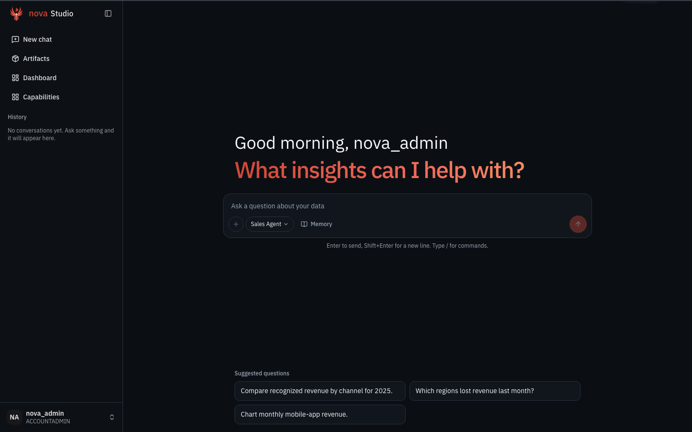
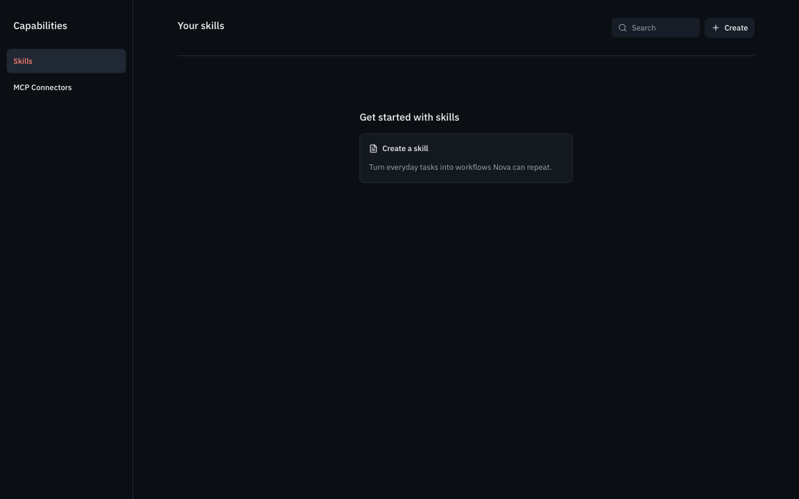
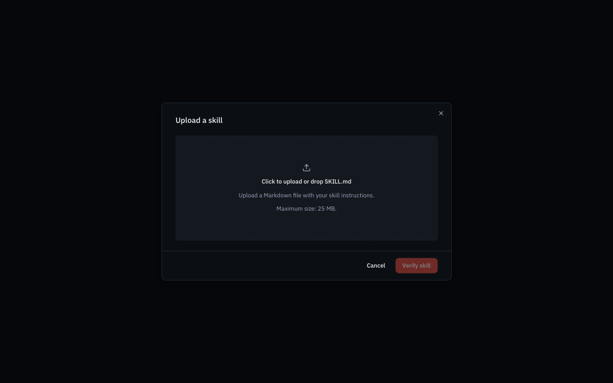
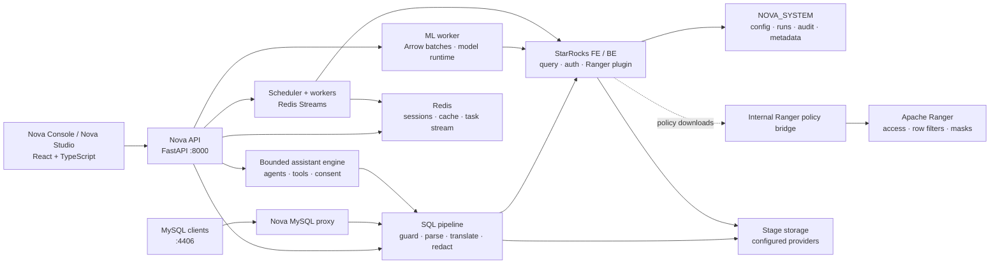

<div align="center">
  

# Nova

**Governed analytics and AI on StarRocks.**

Nova brings SQL development, data operations, access control, machine learning,
and agent workflows into one platform. Apache Ranger governs access to user
data; StarRocks runs the queries.

[Explore the app](#the-nova-app) · [Architecture](#architecture) · [Run locally](#run-locally) · [Documentation](#documentation)
</div>

## What Nova does

Nova has two connected surfaces:

| Surface          | Work you can do                                                                                                                                      |
| ---------------- | ---------------------------------------------------------------------------------------------------------------------------------------------------- |
| **Nova Console** | Write SQL, explore the catalog, work with stages, manage access, run tasks and ML models, inspect monitoring data, and build Intelligence objects.   |
| **Nova Studio**  | Ask governed questions through agents, inspect their work, save results as artifacts, arrange dashboards, and manage personal skills and connectors. |

Both surfaces use the same authenticated StarRocks identity and active role.
SQL clients can also connect through Nova's MySQL protocol proxy on port `4406`.

### SQL and stages

The SQL Workspace uses Monaco and runs Nova SQL through a shared pipeline. A
stage reference keeps file locations and storage credentials out of the query:

```sql
SELECT order_id, total_amount
FROM @sales_stage.orders.2026.parquet
WHERE total_amount > 100;
```

Nova resolves `@stage` to StarRocks `FILES(...)`, detects the format, injects
storage credentials for execution, and records a redacted audit entry. The same
pipeline guards, translates, and redacts user SQL across the supported API,
proxy, and ML paths. Nova-specific SQL belongs in the Workspace, Query API, or
Nova proxy; the native StarRocks port does not parse it.

### Intelligence and ML

- **Intelligence** connects entity identities, AI Search, versioned Semantic
  Views, and Feature Views. Search rechecks source rows under the caller's role;
  semantic validation compares candidate definitions through that caller's
  StarRocks session.
- **Native ML** supports classification, regression, forecasting, anomaly
  detection, and clustering. A bounded worker performs extraction and fitting;
  model versions, aliases, and run metadata are tracked in `NOVA_SYSTEM`.
- **AI functions** such as `AI_COMPLETE` and `AI_SENTIMENT` are available in SQL
  when an AI provider and the corresponding StarRocks functions are configured.

### Nova Studio

Studio is a full-page workspace with agents, saved conversations, process
traces, tables, charts, and citations. Its bounded assistant loop lives in
`backend/app/modules/assistant/`; Agent Studio configures that same loop rather
than running a second one. Studio also supports saved SQL artifacts, personal
skills, dashboards, scoped agent memory, and explicitly selected MCP tools with
per-call consent. Data tools retain the signed-in user's active role.

## The Nova app

The Studio chat image is a frontend preview using sample Sales Agent metadata
from this repository; it does not show a live query result. The other images are
checked-in app and Studio UI captures.

### SQL Workspace


### Database Explorer


### Nova Studio chat



### Nova Studio capabilities



### Nova Studio skill upload



## Architecture


```mermaid
flowchart LR
    Web["Nova Console / Nova Studio<br/>React + TypeScript"]
    Client["MySQL clients<br/>:4406"]
    API["Nova API<br/>FastAPI :8000"]
    Proxy["Nova MySQL proxy"]
    SQL["SQL pipeline<br/>guard · parse · translate · redact"]
    Agent["Bounded assistant engine<br/>agents · tools · consent"]
    ML["ML worker<br/>Arrow batches · model runtime"]
    Tasks["Scheduler + workers<br/>Redis Streams"]
    FE["StarRocks FE / BE<br/>query · auth · Ranger plugin"]
    System["NOVA_SYSTEM<br/>config · runs · audit · metadata"]
    Redis["Redis<br/>sessions · cache · task stream"]
    Bridge["Internal Ranger policy bridge"]
    Ranger["Apache Ranger<br/>access · row filters · masks"]
    Stage["Stage storage<br/>configured providers"]

    Web --> API
    Client --> Proxy
    API --> SQL
    Proxy --> SQL
    API --> Agent
    Agent --> SQL
    API --> ML
    API --> Tasks
    SQL --> FE
    ML --> FE
    Tasks --> FE
    FE --> System
    API --> Redis
    Tasks --> Redis
    FE -.->|policy downloads| Bridge
    Bridge --> Ranger
    SQL --> Stage
    FE --> Stage
```

| Layer              | Responsibility                                                                                                                                                                                                                      |
| ------------------ | ----------------------------------------------------------------------------------------------------------------------------------------------------------------------------------------------------------------------------------- |
| **Web**            | React 19, Vite, TanStack Router, Monaco, and shadcn/ui provide the Console and standalone Studio.                                                                                                                                   |
| **API and proxy**  | FastAPI serves the application and HTTP API. The MySQL proxy carries Nova-aware SQL and session behavior to existing clients.                                                                                                       |
| **SQL dialect**    | The StarRocks grammar, Nova translator, credential injector, and guard prepare statements before execution. Parser generation uses Java at build time; the request path runs in Python.                                             |
| **StarRocks**      | Version 4.1.4 is the query engine and authentication source. The patched FE passes Nova's single active role into Ranger checks.                                                                                                    |
| **Ranger**         | Ranger 2.9.0 owns object permissions, row filters, and masks in the full security profile. Nova manages policies; the StarRocks Ranger plugin enforces them. An internal, authenticated bridge supplies policy downloads to the FE. |
| **State and jobs** | `NOVA_SYSTEM` is a StarRocks database with prefixed tables for configuration, metadata, runs, and audit records. Redis carries sessions, caches, and task work; scheduled execution uses separate scheduler and worker processes.   |
| **Storage and ML** | Stages abstract configured object storage. ML workers read governed StarRocks data in bounded batches and store versioned artifacts through the configured storage connection.                                                      |

### Authorization path

```text
User signs in to StarRocks
  -> Nova validates one assigned active role
  -> user-data execution reasserts SET ROLE and verifies CURRENT_ROLE()
  -> patched StarRocks FE passes userRoles={active_role} to its Ranger plugin
  -> plugin evaluates Ranger access policies, row filters, and masks
  -> Nova returns the governed result and writes its audit record
```

The active role comes from the authenticated session, including in Studio,
semantic queries, ML, and scheduled work. Native StarRocks object grants are
not an authorization fallback in full Ranger mode. The native SQL port stays
inside the Docker network in the standard stack; the development override binds
it to loopback only. `ACCOUNTADMIN` is protected from drop and revoke operations.
For the trust boundaries, role switching, policy propagation, and migration
procedure, see [Ranger authorization](docs/arch-08-ranger-authorization.md) and
[Ranger access control](docs/29-ranger-access-control.md).

## Run locally

You need Docker Compose, Node.js, [pnpm](https://pnpm.io/), Python 3.11, and
[uv](https://docs.astral.sh/uv/).

1. Create `docker/.env` from `docker/.env.example`. Set `NOVA_SECRET_KEY` and
   `NOVA_FERNET_KEY` to generated, persistent values before starting the app.

   ```bash
   cp docker/.env.example docker/.env
   openssl rand -hex 32
   cd backend && uv sync
   uv run python -c "from cryptography.fernet import Fernet; print(Fernet.generate_key().decode())"
   ```

   Put the first generated value in `NOVA_SECRET_KEY` and the Fernet value in
   `NOVA_FERNET_KEY` in `docker/.env`. Return to the repository root.

2. Start StarRocks, Ranger, storage, Redis, and the Nova API/proxy.

   ```bash
   docker compose --env-file docker/.env \
     -f docker/docker-compose-engine.yml --profile app up --build -d
   docker compose --env-file docker/.env \
     -f docker/docker-compose-engine.yml ps
   ```

3. Start the web app.

   ```bash
   cd frontend
   pnpm install
   pnpm dev
   ```

Open [Nova at localhost:5173](http://localhost:5173). The API runs at
`localhost:8000`, the Nova MySQL proxy at `localhost:4406`, and Ranger Admin
at `localhost:6080` for local operations. The initial `nova_admin` password is
`nova`; the first login requires a change.

For host-side backend development and task scheduler/worker setup, use
[HOW_TO_RUN.md](HOW_TO_RUN.md) and the [Ranger runbook](docs/29-ranger-access-control.md).
The latter documents the loopback-only StarRocks development override and the
live security acceptance script.

## Repository

```text
nova/
├── backend/                 FastAPI, SQL pipeline, Studio engine, ML, scheduler
│   ├── app/modules/          Domain services and API routes
│   ├── app/proxy/            MySQL protocol proxy
│   ├── app/sql_dialect/      StarRocks grammar and generated Python parser
│   └── tests/                Unit, integration, eval, and benchmark suites
├── frontend/                React Console and Nova Studio
├── docker/                  StarRocks, Ranger, Redis, storage, and bootstrap
├── patches/starrocks/       Verified FE patches for Ranger role context
├── docs/                    Product, architecture, operations, and research
└── workspace/               Example agent workspaces
```

## Documentation

| Topic                   | Read                                                                                                                                                                                                                           |
| ----------------------- | ------------------------------------------------------------------------------------------------------------------------------------------------------------------------------------------------------------------------------ |
| Product and local setup | [Overview](docs/01-overview.md), [run guide](HOW_TO_RUN.md)                                                                                                                                                                    |
| SQL and stages          | [Dialect architecture](docs/arch-01-sql-dialect-engine.md), [stage manager](docs/04-stage-manager.md), [storage layer](docs/arch-02-storage-provider-layer.md)                                                                 |
| Security                | [Ranger authorization architecture](docs/arch-08-ranger-authorization.md), [access control runbook](docs/29-ranger-access-control.md)                                                                                          |
| Studio and agents       | [Agentic harness](docs/benchmarks/nova-124-agentic-harness.md), [Studio memory](docs/benchmarks/nova-studio-agent-memory-2026-09-23.md), [Studio evidence harness](docs/benchmarks/nova-studio-evidence-harness-2026-09-23.md) |
| Intelligence and ML     | [Intelligence foundation](docs/28-intelligence-foundation.md), [native ML runtime](docs/28-native-ml-runtime.md)                                                                                                               |
| Tasks and state         | [Task manager](docs/08-task-manager.md), [NOVA_SYSTEM architecture](docs/arch-06-nova-system-database.md)                                                                                                                      |

Nova is under active development. The linked module documents describe
capabilities, configuration, and known limitations in more detail. In the local
Ranger stack, policy propagation is asynchronous; Nova's own audit log remains
enabled, while the pinned StarRocks FE image does not include the audit
destination modules needed to send FE authorization decisions to Solr.

## Development checks

```bash
cd backend
uv run pytest tests/unit
uv run python -m tests.eval.report
uv run ruff check .
```

```bash
cd frontend
pnpm lint
pnpm test
pnpm build
```

## Support

[](https://ko-fi.com/dwickyferi)

## License

Internal project; not yet licensed for distribution.
