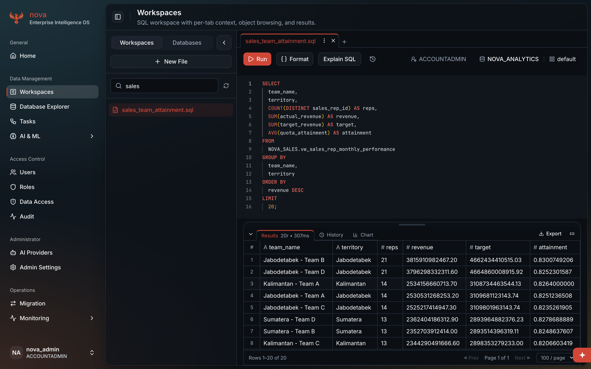
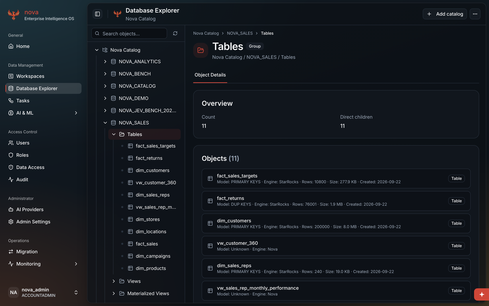
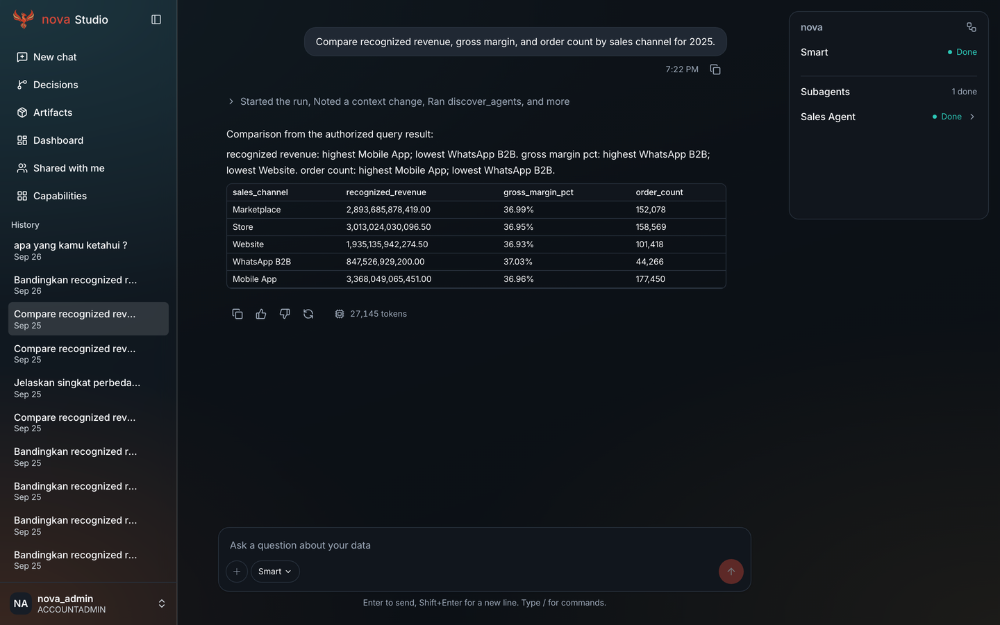
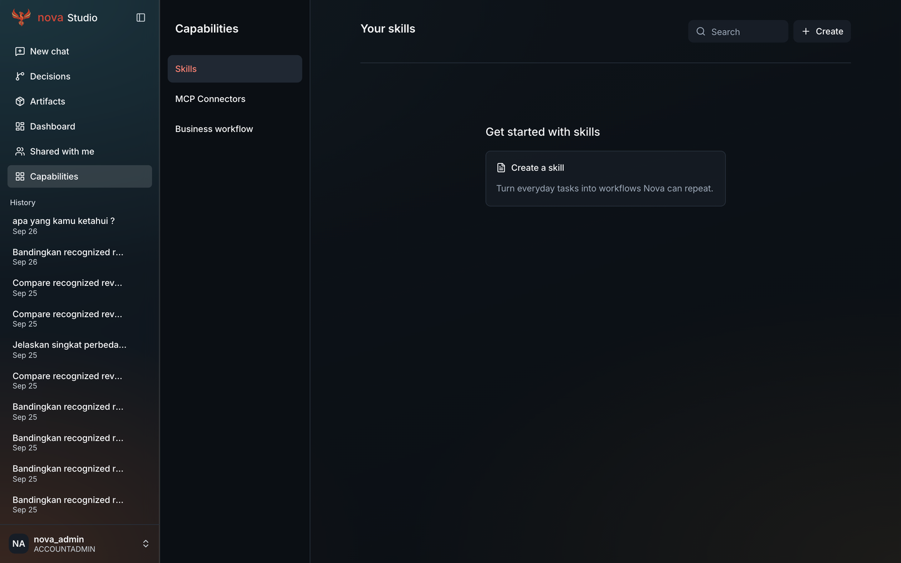
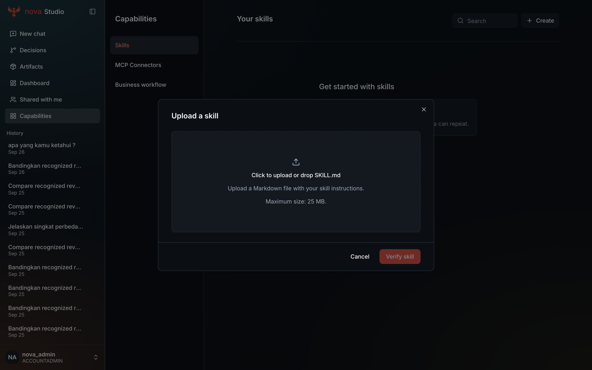
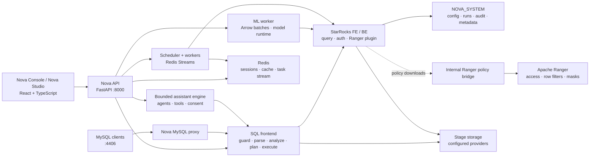
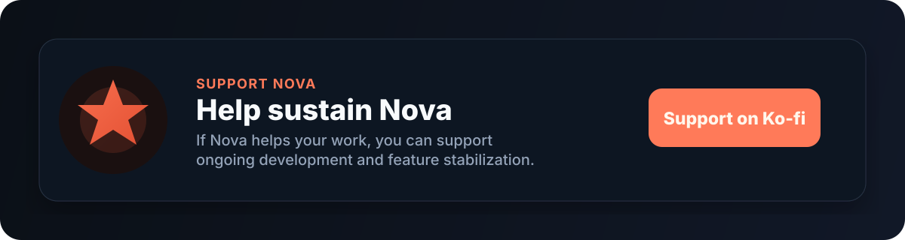

<div align="center">
  

# Nova

**Enterprise Intelligence OS**

Turn governed enterprise data into understanding, decisions, actions, and learning.

Nova unifies governed data, business semantics, organizational context, AI agents,
decision intelligence, and governed execution in one platform.

[See the app](#the-nova-app) · [Architecture](#architecture) · [Run locally](#run-locally) · [Documentation](#documentation) · [Brand assets](frontend/public/images/BRAND.md)
</div>

## What Nova is

Nova is an Enterprise Intelligence Operating System for people and agents to
understand what is happening, investigate why, decide what to do, act under
review, and learn from observed outcomes. It connects that work to governed
data, shared business definitions, and organizational context.

The warehouse, SQL, stages, and ML form its data foundation. StarRocks provides
Nova's analytical query and storage engine and authenticates users. Nova owns
SQL semantics and execution routing, business context, and governed workflows.
In Ranger-enabled deployments, Apache Ranger policies govern user-data access
through the patched StarRocks frontend.

## The enterprise intelligence loop

```text
Governed data
      ↓
Business semantics
      ↓
Business context
      ↓
Understand → Investigate → Decide → Act → Observe outcome → Learn
     ↑                                                       │
     └────────── Reviewed knowledge and improvements ─────────┘
```

Semantic Views define business meaning; investigations retain evidence and
assumptions; Decisions record options and policy review. Supported Actions
require approval and consent. Outcomes distinguish observed results from causal
effects, and learning produces scoped knowledge or proposals for review.
Availability depends on deployment controls and the supported adapters described
below; the loop is the product model, not a claim of unattended execution.

## Nova Console and Nova Studio

| Surface | Role |
| --- | --- |
| **Nova Console** | The data and control foundation: SQL Workspace, catalog and Database Explorer, stages, ingestion/export, ML, tasks, security, Semantic Views, Intelligence objects, and monitoring. |
| **Nova Studio** | The intelligence workspace: agents and Smart collaboration, Missions, investigations, evidence, scenarios, Decisions, governed Actions, Outcomes, artifacts, dashboards, skills, and connectors. |

Both surfaces operate on the same governed enterprise foundation and authenticated
StarRocks identity with one active role. Studio is where people and agents
investigate, plan, decide, and act using governed business context. Chat, process
traces, tables, charts, and citations make that work accessible and reviewable.
SQL clients also use Nova's SQL path through the MySQL protocol proxy on port `4406`.

## Core capabilities

### Data foundation

SQL development, catalog exploration, stages, data loading/export, scheduled
tasks, monitoring, and native ML remain core platform capabilities. ML supports
classification, regression, forecasting, anomaly detection, and clustering,
with versioned models and run metadata in `NOVA_SYSTEM`. SQL AI functions such
as `AI_COMPLETE` and `AI_SENTIMENT` require a configured provider and the
corresponding StarRocks functions.

The SQL Workspace uses Monaco and runs Nova SQL through a shared pipeline.
Stage references keep physical file locations and storage credentials out of
user queries:

```sql
SELECT order_id, total_amount
FROM @sales_stage.orders.2026.parquet
WHERE total_amount > 100;
```

Nova authorizes stage access, resolves `@stage` to StarRocks `FILES(...)`, detects
the format, resolves storage credentials for execution, and records a redacted
audit entry. The same pipeline guards, translates, and redacts user SQL across
the supported API, proxy, and ML paths. Nova-specific SQL belongs in the
Workspace, Query API, or Nova proxy; the native StarRocks port does not parse it.

### Semantic layer

Entity identities, versioned Semantic Views, metrics, relationships, and verified
queries define governed business meaning. Semantic validation compares candidate
definitions through the caller's StarRocks session before publication. AI Search
rechecks source rows under the caller's role; Feature Views provide versioned
features for ML.

### Business context

Context Graph links published semantic definitions with knowledge and decision
revisions. Traversal checks access to each referenced object. Scoped agent
memory preserves provenance and separates private inferred knowledge from
reviewed shared definitions.

### Intelligence runtime

Agents and Smart specialists use the shared bounded assistant engine. Tools,
personal skills, scoped memory, artifacts, dashboards, and explicitly selected
MCP connectors support their work. Data tools retain the signed-in user's active
role; external tool calls retain per-call consent. Missions persist business
work and its run, evidence, and object references when the workflow is enabled.

### Decisions and governed actions

Investigations connect analytical evidence to hypotheses and registered
scenarios. Decisions retain assumptions, uncertainty, policy, and approval.
Current Action adapters create and verify governed monitors/schedules or internal
Studio automations. Execution requires current authorization, reviewer approval,
and separate consent. Inventory transfers and rollbacks remain recommendations;
these adapters do not execute them or deliver externally.

### Outcomes and learning

Outcomes record observation windows, completeness, and attribution limits.
Complete observations can produce private inferred knowledge pinned to an
Outcome revision. Agent Quality Lab evaluates cases and regressions, and
produces reviewable improvement proposals. Publishing shared business meaning
or a manifested agent release still requires review and evaluation.

### Availability and limits

The [governed Studio workflow](docs/arch-15-governed-studio.md) adds release
manifests, Quality Lab, Missions, evidence health, and supervised Actions.
Workflow, Action execution, production quality scoring, and analytical workspace
controls default to disabled. The analytical workspace remains
`BLOCKED_BY_INFRASTRUCTURE` when enabled because no isolated executor ships.
External model and MCP behavior remains mutable even with pinned release
contracts. Verified Action setup does not prove a business intervention or
causal improvement.

See the [operator guide](docs/governed-studio-operations.md) for migrations,
controls, and acceptance gates. Local deterministic checks do not establish
patched-FE Ranger enforcement, live-provider quality, or production readiness.

### The Nova platform stack

This is a conceptual product view. These layers share existing runtime owners;
they do not represent separate physical services.

| Layer | Capabilities |
| --- | --- |
| Nova Studio | Missions, investigations, Decisions, Actions, Outcomes, artifacts |
| Intelligence runtime | Agents, Smart collaboration, skills, tools, memory |
| Business context | Context Graph, knowledge, business policies |
| Semantic layer | Semantic Views, metrics, relationships, verified queries |
| Data foundation | SQL, warehouse, catalog, stages, ML, StarRocks |
| Control plane across the stack | Security, Ranger, Quality, audit, `NOVA_SYSTEM`, Redis runtime coordination |

Nova Console exposes the data and control foundation across these layers.

## The Nova app

These images are captures of a local development instance running demo sales
data. The Studio workspace shows a saved conversation in which Smart delegated
the question to a Sales Agent.

### SQL Workspace



### Database Explorer



### Nova Studio: governed intelligence workspace



### Nova Studio capabilities



### Nova Studio skill upload



## Architecture

StarRocks owns physical planning and distributed analytical execution. Nova
composes that engine with its SQL frontend, shared assistant runtime, and
governed control plane:


```mermaid
flowchart LR
    Web["Nova Console / Nova Studio<br/>React + TypeScript"]
    Client["MySQL clients<br/>:4406"]
    API["Nova API<br/>FastAPI :8000"]
    Proxy["Nova MySQL proxy"]
    SQL["SQL frontend<br/>guard · parse · analyze · plan · execute"]
    Agent["Bounded assistant engine<br/>agents · tools · consent"]
    ML["ML worker<br/>Arrow batches · model runtime"]
    Tasks["Scheduler + workers<br/>Redis Streams"]
    FE["StarRocks FE / BE<br/>query · auth · Ranger plugin"]
    System["NOVA_SYSTEM<br/>config · runs · audit · metadata"]
    Redis["Redis<br/>sessions · cache · task stream"]
    Bridge["Internal Ranger policy bridge"]
    Ranger["Apache Ranger<br/>access · row filters · masks"]
    Stage["Stage storage<br/>configured providers"]

    Web --> API
    Client --> Proxy
    API --> SQL
    Proxy --> SQL
    API --> Agent
    Agent --> SQL
    API --> ML
    API --> Tasks
    SQL --> FE
    ML --> FE
    Tasks --> FE
    FE --> System
    API --> Redis
    Tasks --> Redis
    FE -.->|policy downloads| Bridge
    Bridge --> Ranger
    SQL --> Stage
    FE --> Stage
```

| Layer              | Responsibility                                                                                                                                                                                                                      |
| ------------------ | ----------------------------------------------------------------------------------------------------------------------------------------------------------------------------------------------------------------------------------- |
| **Web**            | React 19, Vite, TanStack Router, Monaco, and shadcn/ui provide the Console and standalone Studio.                                                                                                                                   |
| **API and proxy**  | FastAPI serves the application and HTTP API. The MySQL proxy carries Nova-aware SQL and session behavior to existing clients.                                                                                                       |
| **SQL dialect**    | The central ANTLR frontend builds typed statements and plans, then routes execution to StarRocks or Nova services. Parser generation uses Java at build time; the request path runs in Python.                                             |
| **StarRocks**      | Version 4.1.4 is the query engine and authentication source. The patched FE passes Nova's single active role into Ranger checks.                                                                                                    |
| **Ranger**         | Ranger 2.9.0 owns object permissions, row filters, and masks in the full security profile. Nova manages policies; the StarRocks Ranger plugin enforces them. An internal, authenticated bridge supplies policy downloads to the FE. |
| **State and jobs** | `NOVA_SYSTEM` is a StarRocks database with prefixed tables for configuration, metadata, runs, and audit records. Redis carries sessions, caches, and task work; scheduled execution uses separate scheduler and worker processes.   |
| **Storage and ML** | Stages abstract configured object storage. ML workers read governed StarRocks data in bounded batches and store versioned artifacts through the configured storage connection.                                                      |

### Authorization path

```text
User signs in to StarRocks
  -> Nova validates one assigned active role
  -> user-data execution reasserts SET ROLE and verifies CURRENT_ROLE()
  -> patched StarRocks FE passes userRoles={active_role} to its Ranger plugin
  -> plugin evaluates Ranger access policies, row filters, and masks
  -> Nova returns the governed result and writes its audit record
```

The active role comes from the authenticated session, including in Studio,
semantic queries, ML, and scheduled work. Native StarRocks object grants are
not an authorization fallback in full Ranger mode. The native SQL port stays
inside the Docker network in the standard stack; the development override binds
it to loopback only. `ACCOUNTADMIN` is protected from drop and revoke operations.
For the trust boundaries, role switching, policy propagation, and migration
procedure, see [Ranger authorization](docs/arch-08-ranger-authorization.md) and
[Ranger access control](docs/29-ranger-access-control.md).

## Run locally

You need Docker Compose, Node.js, [pnpm](https://pnpm.io/), Python 3.11, and
[uv](https://docs.astral.sh/uv/).

1. Create `docker/.env` from `docker/.env.example`. Set `NOVA_SECRET_KEY` and
   `NOVA_FERNET_KEY` to generated, persistent values before starting the app.

   ```bash
   cp docker/.env.example docker/.env
   openssl rand -hex 32
   cd backend && uv sync
   uv run python -c "from cryptography.fernet import Fernet; print(Fernet.generate_key().decode())"
   ```

   Put the first generated value in `NOVA_SECRET_KEY` and the Fernet value in
   `NOVA_FERNET_KEY` in `docker/.env`. Return to the repository root.

2. Start StarRocks, Ranger, storage, Redis, and the Nova API/proxy.

   ```bash
   docker compose --env-file docker/.env \
     -f docker/docker-compose-engine.yml --profile app up --build -d
   docker compose --env-file docker/.env \
     -f docker/docker-compose-engine.yml ps
   ```

3. Start the web app.

   ```bash
   cd frontend
   pnpm install
   pnpm dev
   ```

Open [Nova at localhost:5173](http://localhost:5173). The API runs at
`localhost:8000`, the Nova MySQL proxy at `localhost:4406`, and Ranger Admin
at `localhost:6080` for local operations. The initial `nova_admin` password is
`nova`; the first login requires a change.

For host-side backend development and task scheduler/worker setup, use
[HOW_TO_RUN.md](HOW_TO_RUN.md) and the [Ranger runbook](docs/29-ranger-access-control.md).
The latter documents the loopback-only StarRocks development override and the
live security acceptance script.

## Repository

```text
nova/
├── backend/                 FastAPI, SQL pipeline, Studio engine, ML, scheduler
│   ├── app/modules/          Domain services and API routes
│   ├── app/proxy/            MySQL protocol proxy
│   ├── app/sql_dialect/      StarRocks grammar and generated Python parser
│   └── tests/                Unit, integration, eval, and benchmark suites
├── frontend/                React Console and Nova Studio
├── docker/                  StarRocks, Ranger, Redis, storage, and bootstrap
├── patches/starrocks/       Verified FE patches for Ranger role context
├── docs/                    Product, architecture, operations, and research
└── workspace/               Example agent workspaces
```

## Documentation

| Topic | Read |
| --- | --- |
| Platform overview | [Product model, principles, and terminology](docs/01-overview.md) |
| Data and SQL | [Frontend and planner](docs/arch-13-sql-frontend.md), [dialect architecture](docs/arch-01-sql-dialect-engine.md), [stage manager](docs/04-stage-manager.md), [storage layer](docs/arch-02-storage-provider-layer.md) |
| Semantics and business context | [Intelligence foundation](docs/28-intelligence-foundation.md) |
| Studio and agents | [Smart collaboration](docs/arch-11-smart-collaboration.md), [Decision Mode for runtime routing](docs/arch-12-studio-decision-mode.md) |
| Decisions and governed workflows | [Governed Studio](docs/arch-15-governed-studio.md), [operations and acceptance](docs/governed-studio-operations.md) |
| Security and governance | [Ranger authorization architecture](docs/arch-08-ranger-authorization.md), [access control runbook](docs/29-ranger-access-control.md) |
| ML | [Native ML runtime](docs/28-native-ml-runtime.md) |
| Operations | [Run guide](HOW_TO_RUN.md), [task manager](docs/08-task-manager.md), [NOVA_SYSTEM architecture](docs/arch-06-nova-system-database.md) |

Nova is under active development. The linked module documents describe
capabilities, configuration, and known limitations in more detail. In the local
Ranger stack, policy propagation is asynchronous; Nova's own audit log remains
enabled, while the pinned StarRocks FE image does not include the audit
destination modules needed to send FE authorization decisions to Solr.

## Development checks

```bash
cd backend
uv run pytest tests/unit
uv run python -m tests.eval.report
uv run ruff check .
```

```bash
cd frontend
pnpm lint
pnpm test
pnpm build
```

## Support

[](https://ko-fi.com/dwickyferi)

## License

Internal project; not yet licensed for distribution.
