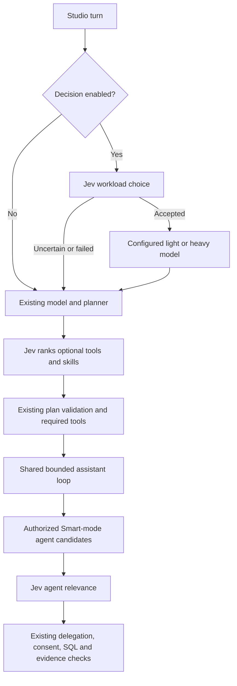

# Architecture 12: Studio Decision Mode

> Optional System One judgments guide model and capability selection inside Nova's existing bounded assistant engine.

The scope is limited to four decisions: light/heavy model, Smart-mode agent, tools, and skills.
Semantic View selection, ML algorithms, database connections, conversation history, and
agent coordination retain their existing behavior. The earlier extended benchmark and its
results describe a superseded implementation and must not be used to assess this version.

## Research

The term in this integration is **System One**, and the registered model is **Jev** (not “Jef”). TypeSafe's interface accepts context plus typed questions, rather than chat messages. Its `choice`, `score`, and `noul` outputs support selection, ordinal assessment, and yes/no probability. Nova currently uses `choice` only. See the [TypeSafe API](https://docs.typesafe.ai/api).

Jev is suitable for small, defined judgment tasks. It is not an answer writer, SQL compiler, authorization engine, or reliable arithmetic evaluator. The vendor documents sensitivity to irrelevant context, adversarial input, and numerical reasoning. Therefore Nova retains its LLM planner, SQL validation, consent, access checks, and verified evidence requirements. See [known model limitations](https://docs.typesafe.ai/model-jaggedness/jev-1.13).

`confidence` describes the concentration of the answer distribution; it is not itself the probability that the decision is correct. Nova checks both the winning probability and confidence, and rejects close contests. These thresholds are operating policies, not a calibration claim. See [confidence semantics](https://docs.typesafe.ai/confidence).

Independent relevance questions can share one state. This fits ranking tools, skills and specialists while preserving multiple candidates for compound requests. The vendor's [fan-out pattern](https://docs.typesafe.ai/patterns/fan-out) and [skill suggestion cookbook](https://docs.typesafe.ai/cookbooks/skill_suggestion) motivate bounded catalogs and an explicit no-fit outcome. Vendor benchmark results are not Nova results.

[RouteLLM](https://arxiv.org/abs/2406.18665) treats routing as a quality/cost tradeoff learned from preferences. [RouterBench](https://arxiv.org/abs/2403.12031) evaluates routers against outcomes from several models. Their implication for Nova is that correctly labeling a workload “heavy” does not prove a better final answer. The selected light/heavy models still need task-specific evaluation.

## Architecture



## Implementation

The adapter is `app/modules/assistant/decision.py`. It posts to the provider's exact stored endpoint, including path and query, without appending `/chat/completions`, `/models`, or any other suffix. It implements the TypeSafe `state`/`questions` contract. “Decision” is a provider category, not a claim that all decision vendors share a standard protocol.

A minimal inference request is a POST to that full URL, with JSON such as:

```json
{
  "model": "jev-1-13-free",
  "state": {"request": "Explain a table and a view in two sentences."},
  "questions": {
    "selection": {
      "type": "choice",
      "instructions": "Choose the reasoning workload required by the request.",
      "criteria": {
        "light": "Simple explanation or straightforward lookup.",
        "heavy": "Complex analysis, audit, diagnosis or multi-step reasoning.",
        "none": "Insufficient context or no confident fit."
      }
    }
  }
}
```

The `answers.selection` response must identify `type: choice`, the chosen label, a probability for each offered label, and confidence. Nova validates these values rather than treating a label alone as sufficient. Authentication uses the registered provider key internally when present. This example simplifies the production criteria; the adapter's bounded context and validation remain authoritative.

Every request revalidates active model/provider records, reads credentials internally, applies the existing outbound HTTP guard, and refuses redirects. Responses must contain the expected question IDs, exactly the offered labels, finite probabilities, a normalized distribution and a consistent winning choice. Provider errors are reduced to bounded status codes in trace metadata. Candidate IDs, accepted choices, probability/confidence, model version and latency are recorded without request bodies or credentials.

Each turn allows six calls and twelve seconds total decision latency, bounded again by the loop's remaining deadline. Catalogs are bounded to 64 candidates, requests to 60 KB, responses to 200 KB, and individual calls to the configured timeout (four seconds by default for new settings). There is no automatic retry. Overflow, inactive configuration, invalid output, timeout and uncertainty return to the existing implementation. Tool result rows and attachment bodies are not separately sent as decision context; the user's bounded request and recent conversation may contain user-supplied values.

## Integration Points

| Decision | Integration | Boundary |
|---|---|---|
| Light/heavy model | Before Studio planner resolution | Both targets must be active registered LLMs. A failed decision or unavailable target retains the original selection. Once resolved, the selected model uses the existing planner and response path. |
| Similar specialists | Smart `discover_agents` | Access is checked before ranking. Exact semantic matches stay ahead of other candidates. Candidates are reordered, not authorized or spawned by Jev. The existing LLM assigns objectives. |
| Relevant skills | Summary relevance, then bounded skill-body confirmation using the validated execution intent | At most two discoverable skills; uncertain confirmations retain baseline choices and reject additions. Default skills remain loaded by the existing loop. |
| Relevant tools | Batched refinement of the LLM-selected tools | Required tools are retained; Jev can remove irrelevant optional tools but cannot expand the executable plan. Collaboration tools remain available. |

JEV does not add planner retries, switch models after answer generation begins, or change
response collection. Planner/provider failures use the existing error path. Decision mode
does not guarantee that the selected model will complete a task successfully.

## Configuration

AI Providers → **Decision** exposes an enable switch plus decision, light-workload and heavy-workload model selectors. Save applies changes to new turns. Disabling remains possible even if a previously selected model has been deleted. There is no new database or migration: a JSON settings value lives in the existing StarRocks primary-key preferences table under `__system__ / studio_decision_mode`.

`GET /api/v1/ai/decision-settings` requires authentication. `PUT` requires an existing admin role and writes an audit entry. The default is disabled. Tests override configuration locally; live benchmark commands never enable production mode or replace saved choices.

## Validation plan

1. Freeze synthetic Indonesian/English development and holdout labels before live calls.
2. Check exact endpoint use, inactive models, unknown labels, malformed probabilities, response limits, timeout, cancellation, disabled zero-inference behavior, config persistence and admin gating.
3. Exercise shared-loop trajectories for consent, required evidence, and SQL drafting restrictions with decision mode on/off.
4. Run the existing eval scorecard and targeted regression suites for the four decision hooks and disabled-mode parity.
5. Compare development results, optimize only from development failures, then evaluate the separate holdout. Record coverage, abstention, latency and input tokens alongside accuracy.
6. Review paired baseline/decision outputs as an LLM judge for request coverage, false tool use, ambiguity and unsupported claims. Report disagreements and limits; do not equate routing labels with end-to-end factual accuracy.
7. Verify settings UI save/disable, error/retry, unavailable models, keyboard, desktop/narrow widths and both themes using browser tests and screenshots.

## Limitations

The registered Kenari endpoint was verified with model `jev-1-13-free`; its response identifies `jev-1.13-free`. Provider transport latency includes the gateway and differs from vendor model latency. No vendor pricing or “faster by X” claim is assumed for Kenari. Large catalogs fall back rather than silently discarding candidates. The LLM planner still runs, so this version adds decision overhead and does not claim a planner-token saving.

Workload classification cannot assess unseen attachment content. Follow-up-only requests without sufficient current context may abstain. Saved configuration is read at turn boundaries; disabling does not cancel an already running turn. Accuracy and financial cost improvements depend on the selected LLM pair and workload distribution and require outcome evaluation.
