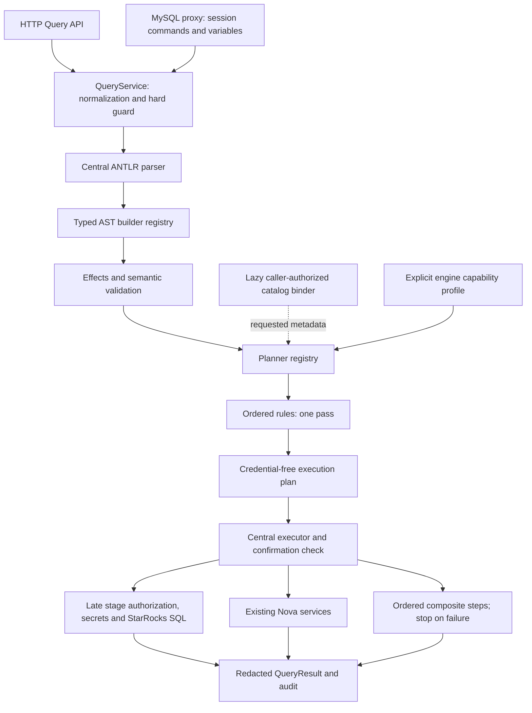

# Architecture 13: SQL Frontend and Planner

> Nova owns SQL syntax, meaning, policy and execution routing; StarRocks owns physical planning and distributed execution.

## Architecture

`backend/app/sql_frontend/` contains the request pipeline. `QueryService` retains
normalization, lifecycle, metrics, script sequencing, history and response duties.
It delegates SQL classification, validation, planning and execution.

The service interfaces are synchronous `parse_statement(sql, original_sql=...)`,
asynchronous `SQLPlanner.plan(statement, context)`, and asynchronous
`SQLExecutor.execute(plan, context)`. Execution returns the existing `QueryResult`.

## Implementation

| Package | Responsibility |
| --- | --- |
| `parser.py`, `source.py`, `errors.py` | Case-insensitive ANTLR input, hidden tokens, source spans and sanitized diagnostics |
| `ast/` | Native, stage, task, model, prediction, forecast, security and password-policy nodes |
| `analysis/` | Logical effects and pure validation of supported Nova clauses |
| `binding/` | Injectable catalog protocol and request-local lazy caches |
| `capabilities/` | Conservative engine profiles and optional detection by target |
| `planning/` | Logical intent, exact-type planner registry and execution plan types |
| `rules/` | Explicit registration order; stage lowering descriptors |
| `execution/` | Engine execution, service adapters, stage resolution and composite sequencing |
| `preparation.py` | Guarded preparation for ML training and streaming inputs |
| `security.py` | Grammar-context decoding of managed Ranger operations |

### Source and parsing

Original editor source and normalized source are separate fields. Token offsets
and spans refer to normalized source. Starts are inclusive, ends exclusive;
lines are one-based and columns zero-based. SQL fragments come from source
slices. `getText()` is used only for metadata such as identifiers, never to
reconstruct executable SQL.

Both lexer and parser default error listeners are removed. Errors report a
position and a generic message; rejected tokens and literals are omitted.
Direct execution accepts exactly one complete statement. Script execution keeps
the existing splitter, executes sequentially and stops at the first error.
The hard guard still checks the complete input of direct execution before parsing.

The MySQL proxy classifies all stage spans in one tree while substituting
session variables. `parsing_scope()` caches successful trees for that request.
An unchanged statement reuses its tree in query execution. A substituted or
normalized statement gets a new tree for its changed source. The cache is
discarded at request exit and has no process-wide source retention.

AST builders and planners reject duplicate registration. Native context fallback
is restricted to engine statement contexts. Unregistered Nova contexts and
statement types fail closed. Classification checks task creation before native
task submission, and prediction/forecast forms before ordinary queries.
`EXPLAIN` remains an engine request.

### Effects and plans

`PlanEffects` has six flags: `reads_data`, `writes_data`, `deletes_rows`,
`changes_schema`, `changes_security`, and `external_io`. Destructive confirmation
is a separate `requires_confirmation` property. An INSERT can write data without
acquiring UPDATE/DELETE confirmation behavior.

`LogicalPlan` carries the statement and analysis. Lowering produces one of:

- `EngineSqlPlan`: a safe SQL template, effects and unresolved stage descriptors.
- `NovaActionPlan`: a typed operation payload, effects and a private source key.
- `CompositePlan`: ordered steps whose effects and confirmation requirements
  are the union of their children.

Planning can read explicitly requested catalog metadata and populate request-local
validation caches. It does not persist metadata, fetch storage secrets, submit
engine mutations or call action services. The executor enforces confirmation
again after planning. Rules run once in registration order and may preserve or
expand effects and confirmation requirements; they cannot remove either.

Composite execution stops on an error result or an exception. It provides no
transaction, rollback or compensation guarantee. The final successful step's
`QueryResult` is the composite result. Each executed service/engine step retains
its existing auditing behavior.

### Credentials and stage execution

Plans contain no passwords, resolved storage keys or authenticated connections.
Typed task/model/prediction/security payloads contain safe metadata. Source
fragments and validated SQL bodies remain in private request execution state.
Only plans are suitable for serialization; execution contexts are internal.
Debug representations omit source, encrypted passwords, connections and private
validation caches. Engine plan construction rejects credential-bearing SQL.

The engine adapter restores native source only for the unchanged safe template.
For stages, `stage_view()` reads reference nodes from the central tree and the
ordered stage rule marks the plan for lowering. `StageRuntime` resolves scoped
references and checks access for every selected stage before resolving any
storage secret. Credentials and CSV settings remain keyed by reference offset,
so repeated stage names, joins and different scoped connections stay independent.

The existing translator and injector handle FILES(), LIST, COPY and stage
exports. Secret resolution occurs at execution, immediately before preparation
and engine submission. Responses and audit SQL use the redacted form.
Native FILES() behavior is preserved.

Task creation and password-policy actions never become raw engine statements.
Task bodies containing stage references or explicit populated credentials are
rejected before metadata persistence. Task timezone lookup, owner role,
dependency checks and audit actions remain in the existing services/adapters.

### Binding and capabilities

`CatalogProvider` exposes `resolve_table`, `get_columns` and `get_details`.
`Binder` caches each operation separately for one request. Asking for a table
does not fetch columns or details. Missing or inaccessible tables and missing
columns produce semantic errors. Metadata queries use the caller's identity,
active role, authenticated connection and database/catalog context.

Columns use documented `COLUMN_TYPE`, `ORDINAL_POSITION`, `IS_NULLABLE`,
`COLUMN_DEFAULT` and `GENERATION_EXPRESSION` fields. Results retain ordinal
order. Details use the source of `SHOW CREATE TABLE` to retain key type, primary
keys and the full partition clause where available. The binder preserves the
resolved table/view type. See [StarRocks columns metadata](https://docs.starrocks.io/docs/sql-reference/information_schema/columns/).

The explicit 4.1.4 profile disables `native_merge`, `merge_all_by_name` and
`merge_schema_evolution`. Unknown versions use conservative profiles. Optional
version detection is cached by engine target and runs only when requested.
Native queries, including `SELECT 1`, perform no binding or version query.

## Integration Points

The HTTP query routes and MySQL proxy preserve response shapes, identity, active
role, tenant context, row limits and audit behavior. EXPLAIN uses the same
frontend, stage preparation and engine adapter. ML SQL preparation uses the
shared frontend without routing through QueryService. Assistant SQL validation
uses parsing and pure validation without a catalog or engine connection.

Ranger-enabled planning decodes role creation/deletion, membership, hierarchy,
supported table grants, role listings and access listings from grammar contexts.
Unsupported managed governance forms are rejected; they are never forwarded as
native grants. Native user-account operations retain their prior routing.
The ACCOUNTADMIN/root/UDF/egress guard runs before parsing and Ranger actions.
Ranger-disabled security SQL keeps native execution.

Compatibility APIs remain in `modules/query/dialect/parser.py`, the compact ML
and task parsers, and the old security statement router for existing callers.
They are not production feature detectors. The stage parser's legacy short
circuits do not apply to central SQL parsing. The semantic-expression parser
retains its separate expression entrypoint and compatibility listener.

## Configuration

The frontend requires no database migration or new runtime dependency. It uses
the committed Python parser generated by ANTLR 4.13.2 from the pinned StarRocks
4.1.4 grammar. Java is used only for regeneration.

QueryService accepts injected AST builders, a planner and a catalog-provider
factory. Defaults select the production registries and caller-authorized
StarRocks catalog. Engine capability selection is explicit in planning context.

## Developer Extension Workflow

1. Add syntax inside a marked Nova grammar region, then run
   `bash backend/scripts/generate_grammar.sh`. Add parser corpus cases for
   comments, literals, spans and rejected forms.
2. Add a typed Statement subclass and register an AST builder for its context.
   Slice SQL fragments from normalized source. Do not add a feature detector
   to QueryService.
3. Implement a planner and register its exact statement type. Request only the
   catalog metadata needed through `context.binder`; choose lowering from
   `context.capabilities`. Keep action execution and secrets out of planning.
4. Return safe engine templates, a typed action payload or a composite. Declare
   all effects and any separate confirmation requirement. Register an action
   handler only when an existing service must execute the operation.
5. Add a rule only if lowering requires one; register it in explicit order.
   Prove that it does not remove effects or confirmation requirements.
6. Test native preservation, planner purity, binding caches, capabilities,
   composite ordering/failure, redaction and the real consumer path.

`test_sql_frontend_planning.py` demonstrates capability-dependent composite
lowering with a dummy statement and explicit binding. The consumer test
`test_extension_runs_through_unmodified_query_service_with_injected_catalog`
runs that extension through QueryService without adding a branch to its SQL flow.

MERGE, ALL BY NAME and schema evolution have no syntax or implementation here.
Their future planners can use these registration, binding, capability and
composite interfaces. Physical optimization remains StarRocks's responsibility.
