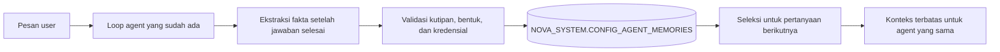

# Nova Studio: memory per agent dan per user

> Riset, rancangan, dan keputusan implementasi memory lintas percakapan untuk aturan bisnis yang disampaikan user.

---

## Kebutuhan

Percakapan Studio sudah tersimpan sebagai thread milik user dan agent. `ContextManager` menjaga ukuran konteks dalam satu thread, tetapi tidak membawa fakta penting ke thread baru. Contoh target: user menerangkan "omzet = invoice lunas dikurangi retur, tanpa PPN" kepada Sales Agent. Pada percakapan Sales berikutnya, agent dapat memakai definisi itu, menyebutnya sebagai informasi yang pernah disampaikan user, dan memperbaruinya saat user mengoreksi rumus.

Memory adalah **pernyataan user**, bukan hasil query yang terverifikasi. Hasil tool, halaman web, dan jawaban model tidak boleh otomatis berubah menjadi aturan bisnis. Memory tidak memberi izin menjalankan tool atau mengubah kebijakan agent.

## Hasil riset

| Pendekatan | Kekuatan | Batas untuk Nova |
|---|---|---|
| Seluruh transkrip di prompt | Tidak perlu ekstraksi | Token dan latensi tumbuh bersama percakapan; sulit membedakan fakta lama dan koreksi. |
| Ringkasan per thread | Murah dibaca | Aturan lintas thread dan asal kutipannya mudah hilang. |
| Fakta terstruktur dengan sumber | Ringkas, dapat diperbarui dan dihapus | Ekstraksi model dapat keliru; perlu bukti kutipan dan evaluasi. |
| Embedding atau graph memory | Pencarian semantik dan hubungan kompleks | Menambah penyimpanan, model embedding, dan migrasi sebelum kebutuhan skalanya terbukti. |

[Generative Agents](https://arxiv.org/abs/2304.03442) memisahkan observasi, retrieval, dan refleksi; relevansi, kebaruan, dan kepentingan menentukan apa yang dibaca kembali. [Mem0](https://arxiv.org/abs/2504.19413) mengevaluasi ekstraksi, konsolidasi, dan retrieval fakta untuk percakapan panjang. [LongMemEval](https://arxiv.org/abs/2410.10813) menekankan lima kemampuan yang perlu diukur: ekstraksi, reasoning lintas sesi, waktu, pembaruan pengetahuan, dan abstention. [LoCoMo](https://github.com/snap-research/locomo) menyediakan percakapan panjang untuk menguji retensi. [OWASP](https://genai.owasp.org/2026/05/13/memory-is-a-feature-it-is-also-an-attack-surface/) menunjukkan bahwa memory persisten juga menjadi jalur prompt injection yang dapat bertahan antarsesi.

Untuk tahap ini Nova memakai fakta terstruktur dengan kutipan sumber. StarRocks tetap satu-satunya penyimpanan persisten. Pencarian memakai kecocokan kata dan fallback terbatas untuk memory terbaru; tidak ada layanan embedding baru. Ini cukup untuk aturan bisnis yang relatif sedikit, dengan batas skala yang jelas dan terukur.

## Alur yang diimplementasikan

1. Pada turn yang berhasil, model agent mengekstrak paling banyak tiga fakta tahan lama dari **pesan user**. Definisi, rumus, kebijakan, dan preferensi stabil boleh menjadi memory. Pertanyaan biasa, tugas sementara, dan pesan dengan bentuk kredensial dilewati.
2. Setiap fakta mempunyai `fact_key`, teks, kutipan yang harus muncul persis dalam pesan user, dan thread sumber. Fakta baru dapat mengganti fakta dengan key atau ID yang sama; koreksi tidak perlu membuat thread lama diputar ulang.
3. Tabel Primary Key StarRocks menyimpan `user_name`, `agent_id`, dan `role_name` pada setiap baris. Semua operasi baca, ubah, dan hapus menyaring ketiganya di SQL. Cakupan role memperketat batas yang sudah digunakan untuk riwayat percakapan saat user berganti role.
4. Sebelum turn baru, Nova memilih maksimal delapan fakta yang cocok dengan pertanyaan, membatasi konten prompt menjadi 2.400 karakter, dan menandainya sebagai data dari user yang tidak boleh memberi instruksi atau izin. Pernyataan user saat ini mengungguli memory yang bertentangan. Untuk SQL dan metrik, model semantik tetap menjadi acuan; perbedaan dengan definisi yang diingat harus dijelaskan sebelum dipakai menghitung.
5. Studio menyediakan daftar memory per 100 baris, tombol untuk memuat halaman berikutnya, dan penghapusan per fakta. Pembuatan, pembaruan, dan penghapusan masuk `NOVA_SYSTEM.AUDIT_LOG` tanpa menyalin isi fakta ke log. Pagination memakai [`LIMIT ... OFFSET`](https://docs.starrocks.io/docs/sql-reference/sql-statements/table_bucket_part_index/SELECT/SELECT_OFFSET/) yang didukung StarRocks 4.1.

Ekstraksi berlangsung setelah jawaban utama dan dibatasi 15 detik. Kegagalan ekstraksi tidak menggagalkan jawaban chat. Hal ini berarti bila provider tidak tersedia atau batas waktu habis, turn tersebut tidak menghasilkan memory; user dapat melihat daftar memory untuk memeriksanya.

## Rencana dan kriteria penerimaan

| Tahap | Kriteria | Status |
|---|---|---|
| Penyimpanan | Fakta bertahan lintas thread dan restart, di StarRocks | Selesai |
| Isolasi | User, agent, dan role berbeda tidak saling membaca memory | Selesai; diuji di SQL dan eval |
| Koreksi | Definisi lama diperbarui dan sumber berpindah ke turn baru | Selesai; diuji offline dan model Sales |
| Kontrol user | Lihat sumber dan hapus fakta dari Studio | Selesai; tipe frontend diperiksa |
| Benchmark | Bandingkan tanpa memory, recall, koreksi, biaya retrieval | Selesai; hasil di dokumen benchmark |

## Batas saat ini

- Kutipan persis membuktikan asal teks, tetapi tidak membuktikan bahwa parafrase model sepenuhnya benar. Aturan bernilai tinggi tetap perlu dikonfirmasi user atau diverifikasi terhadap sumber resmi.
- Seleksi kata sederhana dapat melewatkan sinonim saat jumlah memory besar. Jika ukuran dan hasil eval menuntutnya, tahap berikutnya adalah indeks semantik yang tetap berada di StarRocks, disertai ukuran recall pada LongMemEval/LoCoMo dan data aturan bisnis Nova.
- Saat ini retrieval membaca paling banyak 200 memory terbaru per user, agent, dan role sebelum memberi skor. Daftar UI tetap bisa dipaginasi untuk melihat dan menghapus memory yang lebih lama. [Indeks teks StarRocks 4.1](https://docs.starrocks.io/docs/table_design/indexes/inverted_index/) adalah kandidat tahap berikutnya, tetapi masih berstatus beta dan memerlukan konfigurasi cluster.
- Percakapan yang sudah ada sebelum fitur ini tidak dipindai ulang. Ekstraksi dimulai dari turn baru setelah backend memakai kode ini.
- Ekstraksi memakai panggilan model tambahan; tokennya belum masuk ke angka penggunaan loop utama yang terlihat di Studio. Benchmark mengukurnya terpisah.
- Ekstraksi bergantung pada model yang dipilih agent. Jumlah fakta dan bahasa parafrase dapat berubah antar-run. Benchmark mencatat variasi ini, sehingga batas tiga fakta, key, kutipan, dan UI penghapusan diperlukan.
- Cakupan role sengaja lebih ketat daripada permintaan minimum per user dan agent. Fakta yang disampaikan saat role lain aktif tidak muncul sampai user kembali ke role itu.
- Sales Agent lokal sudah mempunyai `recognized_revenue` sebagai metrik default. Dalam benchmark, memory omzet dari user berbeda dengan definisi tersebut. Agent perlu menyebut perbedaan ini dan meminta penyelarasan model semantik sebelum memakai rumus memory untuk query.
- Prompt dan filter bentuk kredensial mengurangi risiko memory poisoning, tetapi tidak menghilangkannya. Memory hanya berasal dari teks user, dibatasi panjang, di-escape saat dibaca kembali, dan tidak dipakai sebagai otoritas tool.

## Berkas utama

- `backend/app/modules/agents/memory.py`: tabel, retrieval, ekstraksi, dan validasi.
- `backend/app/modules/agents/router.py`: endpoint dan integrasi ke turn Studio.
- `frontend/src/features/studio/agent-memory-dialog.tsx`: inspeksi dan penghapusan.
- `backend/tests/eval/test_agent_memory.py`: skenario lintas thread, koreksi, isolasi, dan data yang ditolak.
- `backend/scripts/benchmark_agent_memory_live.py`: benchmark model Sales dengan memory sintetis yang dibersihkan setelah run.
